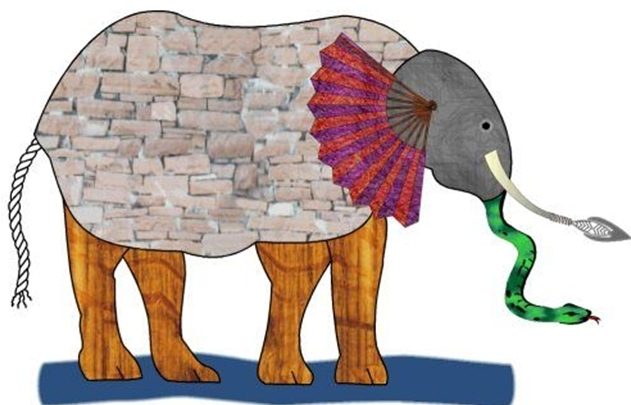

---
#########################################
# options for knitting a single chapter #
#########################################
output:
  bookdown::pdf_document2:
    template: templates/template.tex
  bookdown::html_document2: default
  bookdown::word_document2: default
documentclass: book
#bibliography: [bibliography/references.bib, bibliography/additional-references.bib]
---

# Introduction {#intro}
\chaptermark{Introduction}
\minitoc <!-- this will include a mini table of contents-->

<!-- For PDF output, include these two LaTeX commands after unnumbered chapter headings, otherwise the mini table of contents 
```{=tex}
\adjustmtc
\markboth{Introduction}{}
```
 and the running header will show the previous chapter -->


## Content of the introductory text (wip)

The general concept of Data Integration can be defined as the combination of data from different sources to provide users with a unified view of the data [@lenzerini_data_2002]. However, the practical meaning of the term Integration may vary from, for instance, the computational combination of data to the combination of studies performed independently, the simultaneous analysis of multiple variables on multiple datasets, or any possible approach for homogeneously querying heterogeneous data sources. Therefore, in many cases, integrative analysis may be preferable to a simple combination of data from distinct sources. Integrative analysis allows not only the combination of heterogeneous data but also the combined use of these data to obtain the most relevant information and, what is better, to be able to extract some information that could not be unveiled by the separate analysis of each of the original data types.

Over the past decade, advancements in omics technologies have facilitated high-throughput monitoring of molecular and organism processes. These techniques have been widely applied to identify biological agents and characterize biochemical systems, often focusing on the discovery of therapeutic targets and biomarkers related to specific diseases [@cisek_application_2016],[@wang_proteomics_2014], and [@wang_circulating_2014]. Although many single-omic approaches target comprehensive analysis of genes (genomics), mRNA (transcriptomics), proteins (proteomics), and metabolites (metabolomics), among others, there is still a need to improve omics data analyses through integrative methods [@wanichthanarak_genomic_2015],[@gomez-cabrero_data_2014]. In this sense, the integrative point of view defined in the paragraph above, applied to multi-omics data, is a promising approach to achieving better biomarker development in biomedical research projects, and this is the core idea of this work.

As the field of omics has evolved from analyzing unique types of data to multiple types, it is natural to extend the previous use of multivariate techniques to this new situation. With this aim, classical and new multivariate techniques have been applied for the analysis of multi-omics datasets. Many of these techniques are dimension reduction methods that aim to find the main sources of variability in the data while maximizing some information characteristics, such as the variance of each dataset and the correlation between groups of variables. Examples of such techniques are well-consolidated methods such as Principal Component Analysis (PCA), Singular Value Decomposition (SVD), Correspondence Analysis (CA), and Partial Least Squares (PLS). Besides these more “novel” approaches have been used such as: Principal Components Regression, Coinertia and Multiple Coinertia Analysis, Generalized SVD, Sparse PLS, Multiple Factor Analysis (MFA), or combined versions of them [@mwheelock_trials_2013],[@le_cao_sparse_2009],[@culhane_cross-platform_2003]. Publications such as [@meng_dimension_2016],  [@cavill_transcriptomic_2016], [@wu_selective_2019], [@subramanian_multi-omics_2020], [@krassowski_state_2020], and [@cantini_benchmarking_2021], are good reviews of the state of the art of using multivariate and joint reduction methods for Integrative Multi-Omics Analysis.

Dimension reduction methods, especially those that are able to deal with situations that are typical of the omics context (with many more variables than samples, or possibly sparse matrices with many missing values), have been of great help in visualizing datasets or even in performing variable selection to find biomarkers for a given situation [@wu_selective_2019]. However, there is one point where they underperform other approaches: the difficulty in interpreting results from a biological point of view. This is relatively reasonable because most of these methods work by creating new variables that are a type of linear combination from the original ones. While this is useful, for example, for removing redundancy, it does not provide any clues on what these new dimensions may mean from a biological point of view.

This problem has been known since the introduction of multivariate methods with omics data, but only a few approaches have been taken to deal with this problem. The first attempts to introduce biological information in the analyses consisted of using the most well-known database of biological functions, the Gene Ontology (GO) [@ashburner_gene_2000]. Fellenberg [@busold_integration_2005] introduces a way to integrate Gene Ontology information with Correspondence Analysis to facilitate the interpretation of microarray data. De Tayrac et al. [@de_tayrac_simultaneous_2009] applies multiple factor analysis to the integrative analysis of microarray and DNA copy number data. They applied GO Terms on data visualizations by treating these terms as supplemental information. In recent years, the representation of biological knowledge has shifted from Gene Ontology to Gene Sets [@huang_bioinformatics_2009]. Meng and Culhane [@meng_dimension_2016] have introduced the Integrative Clustering with Gene Set Analysis where gene set expression analysis is performed based on multiple omics data; and Tyekucheva et al. [@tyekucheva_integrating_2011], go one step further and use the results of Gene Set Expression Analysis (GSEA) to integrate different omics data.

Altogether, the previous approaches show several things: Although the idea that integrating quantitative data with biological knowledge may increase interpretability, the number of successful attempts to do this is still small. In this thesis, the use of either classical GO Terms or more flexible annotations (Gene Sets or custom annotations) will be combined with different approaches, and combinations of them, if needed, to guide integrative analysis and improve its biological interpretability from the point of view of biomedical researchers.


## Background/State of the Art
Falta desenvolupar punts

### Omics data analyses

3 problemes esencials (veure projecte recerca Alex):

 * **Omics data may be partly incomplete**, especially in multiomics studies, where not all types of data are usually available for all individuals.

* **The results of these analyses are difficult to interpret**. If we agree that the ultimate goal of many analyzes is a better understanding of the underlying biological processes, for example, in a disease study context, it should be possible to establish a clear relationship between the outcome of an analysis and what this means biologically. And this is not always so.

* **These kind of data analytics are difficult to standardize**, as it is not easy to make complex pipelines of multi-omics analyses, which integrate multiple processes with multiple sources, easy to reproduce or communicate.

Més el problema de la p>>n (Dimensionallity Reduction Techniques; The p>>n situation)

### The problem of having partly incomplete data

Having partly incomplete data is a common challenge in biomedical multi-omics data analyses, where not all omics layers or samples have complete measurements for all variables of interest. This problem, known as missing data, can hinder the integrative analysis and interpretation of multi-omics datasets. 

**Missing Data Types**: Missing data can occur in various forms in multi-omics datasets. For example, some omics layers may have missing values for certain variables (e.g., genes, proteins, metabolites), or specific samples may be missing data for certain omics layers. This can result from technical limitations, experimental design, or inherent biological variability.[@flores_missing_2023]

**Impact on Analysis**: Incomplete data can introduce biases and distort the results of multi-omics analyses. It can affect downstream statistical analyses, clustering, network inference, and machine learning algorithms, leading to inaccurate or unreliable findings. Addressing missing data appropriately is crucial for obtaining valid and meaningful results. Reference: 

**Missing Data Mechanisms**: Understanding the underlying mechanisms of missing data is essential for selecting appropriate imputation methods. Missing data can occur due to different mechanisms, such as missing completely at random (MCAR), missing at random (MAR), or missing not at random (MNAR). These mechanisms influence the choice of imputation techniques and the assumptions made during data analysis.[@little_missing_2002]

**Imputation Methods**: Imputation techniques are employed to estimate missing values in multi-omics datasets. Various imputation methods, including mean imputation, regression imputation, multiple imputation, and machine learning-based approaches, have been proposed to handle missing data in different omics layers. Each method has its assumptions, strengths, and limitations, and the choice of imputation strategy should be carefully considered. Reference: Buuren, S. V., & Groothuis-Oudshoorn, K. (2011). mice: Multivariate imputation by chained equations in R. Journal of Statistical Software, 45(3), 1-67.

**Uncertainty and Sensitivity Analysis**: Dealing with missing data introduces uncertainty in the imputed values and subsequent analyses. Sensitivity analyses, such as multiple imputation and bootstrapping, can help assess the robustness of the results to missing data assumptions and imputation methods. Reference: Sterne, J. A., et al. (2009). Multiple imputation for missing data in epidemiological and clinical research: Potential and pitfalls. BMJ, 338, b2393.

Addressing the issue of incomplete data in multi-omics analyses is crucial to avoid biased or misleading results. By utilizing appropriate imputation methods and understanding the missing data mechanisms, researchers can mitigate the impact of missing data and enhance the accuracy and reliability of their analyses.


### Results interpretation in the context of integrative multi-omics data analyses

Interpretation of results in integrative multi-omics data analyses is a critical challenge due to the complexity and high dimensionality of the data, as well as the need to integrate information from multiple omics layers. Here, I will explain the problem of result interpretation in this context and provide relevant bibliographic references.

**Data Integration Challenges**: Integrating multi-omics data involves combining information from different molecular layers such as genomics, transcriptomics, proteomics, and metabolomics. Each omics layer provides a unique perspective on biological processes, and integrating these layers can reveal comprehensive insights. However, interpreting the integrated results becomes challenging due to the heterogeneity and scale differences among the omics data. Reference: Wang, X., & Zhang, B. (2018). Integrating multiple 'omics' data for biomarker discovery and clinical assessment. Molecular & Cellular Proteomics, 17(6), 991-1003.

**Dimensionality and Complexity**: Multi-omics data analyses often result in high-dimensional datasets with numerous features, making it difficult to interpret the results directly. The challenge lies in identifying the most relevant features or patterns and extracting meaningful biological insights from the vast amount of data. Reference: Nguyen, T. M., et al. (2019). Integrative analysis of multi-omics data for discovery and functional studies of complex human diseases. Advances in Genetics, 103, 143-175.

**Contextual Interpretation**: Interpreting multi-omics results requires considering the biological context, such as pathways, networks, and regulatory interactions. Understanding how different omics layers interact and influence each other within biological systems is crucial for accurate interpretation. Reference: Mei, H., et al. (2017). The road beyond omics: Integration of multi-omics data for the inference of regulatory networks and precision medicine. Computational and Structural Biotechnology Journal, 15, 359-366.

**Validation and Biological Significance**: Integrative multi-omics analyses often generate numerous associations, correlations, or biomarkers. However, validating and determining the biological significance of these findings is a key challenge. Experimental validation, functional enrichment analysis, and comparison with existing knowledge are essential for confirming the biological relevance of the results. Reference: Sun, H., et al. (2020). Strategies for interpreting multi-omics studies in schizophrenia and other neuropsychiatric disorders. Journal of Psychiatric Research, 129, 121-133.

**Visualization and Interactive Tools**: Visualizing and exploring multi-omics data can aid in result interpretation. Interactive visualization tools that integrate different omics layers, provide network views, and enable user-driven exploration can facilitate the interpretation process. Reference: Swatloski, T., & et al. (2020). Multi-Omics Data Integration, Interpretation, and Its Application. Genes, 11(10), 1162.

In summary, the problem of result interpretation in integrative multi-omics data analyses stems from the challenges of data integration, high dimensionality, contextual understanding, validation, and visual exploration. Addressing these challenges requires a combination of statistical methods, biological knowledge, and interactive tools to extract meaningful insights from the integrated data.

### Approaches for the biological and clinical interpretation

The biological and clinical interpretation of multi-omics data analysis results is crucial for gaining insights into the underlying molecular mechanisms, identifying biomarkers, and understanding disease processes.

1. **Pathway and Functional Enrichment Analysis**: Pathway and functional enrichment analysis aim to identify overrepresented biological pathways, gene sets, or functional categories that are significantly associated with the differentially expressed genes or other omics features. These analyses help in understanding the biological processes, molecular functions, and cellular components that are affected in a particular condition or disease. Citation: Khatri, P., et al. (2012). Ten years of pathway analysis: Current approaches and outstanding challenges. PLoS Computational Biology, 8(2), e1002375.

2. **Network Analysis**: Network analysis involves the construction and analysis of biological networks, such as gene regulatory networks or protein-protein interaction networks, using multi-omics data. Network-based approaches help in identifying key hub genes, modules, or subnetworks that play important roles in disease progression or phenotype. Citation: Barabási, A. L., et al. (2011). Network medicine: A network-based approach to human disease. Nature Reviews Genetics, 12(1), 56-68.

3. **Machine Learning and Predictive Modeling**: Machine learning algorithms, such as random forests, support vector machines, or deep learning models, can be applied to multi-omics data to develop predictive models for disease diagnosis, prognosis, or treatment response. These models can uncover potential biomarkers or patterns in multi-omics data and provide insights into disease classification and personalized medicine. Citation: Alizadeh, A. A., et al. (2000). Prediction of survival in diffuse large-B-cell lymphoma based on the expression of six genes. New England Journal of Medicine, 344(14), 1031-1037.

4. **Integration of Multi-Omics Data**: Integrative analysis methods aim to combine and analyze different omics datasets, such as transcriptomics, proteomics, and epigenomics, to identify molecular interactions and relationships across different layers of biological information. These methods enable a more comprehensive understanding of the molecular mechanisms underlying complex diseases or biological processes. Citation: Liu, Y., et al. (2014). A survey of integrative analysis methods for multi-omics data. Statistical Methods in Medical Research, 27(11), 3061-3077.

5. **Data Visualization**: Data visualization techniques, such as heatmaps, scatter plots, or network visualizations, play a crucial role in the interpretation of multi-omics data analysis results. Visualizations help in identifying patterns, clusters, and relationships between variables, enabling researchers to generate hypotheses and communicate findings effectively. Citation: Gehlenborg, N., et al. (2010). Visualization of omics data for systems biology. Nature Methods, 7(3), S56-S68.

These methods, among others, contribute to the biological and clinical interpretation of multi-omics data analysis results, providing insights into disease mechanisms, biomarker discovery, and potential therapeutic targets.

### Data processing and standarization

Data processing and standardization are critical steps in biomedical multi-omics data analyses to ensure data quality, comparability, and compatibility across different omics layers and studies. In this context, I will explain the problem of data processing and standardization and provide relevant bibliographic references.

**Data Preprocessing**: Raw multi-omics data often require preprocessing steps to handle technical variations, correct systematic biases, and remove noise. This may involve background correction, normalization, batch effect removal, and quality control measures to ensure data quality and comparability. Reference: Tarazona, S., et al. (2015). Data quality aware analysis of differential expression in RNA-seq with NOISeq R/Bioc package. Nucleic Acids Research, 43(21), e140.

**Integration Challenges**: Integrating multi-omics data involves combining information from different omics layers, which may have distinct measurement scales, dynamic ranges, and data distributions. Harmonizing the data across omics layers is necessary to enable meaningful comparisons and integrative analyses. Reference: Meng, C., et al. (2014). Dimension reduction techniques for the integrative analysis of multi-omics data. Briefings in Bioinformatics, 17(4), 628-641.

**Missing Data Handling**: In multi-omics datasets, missing data can be present due to technical limitations or experimental designs. Proper handling of missing data, such as imputation or exclusion strategies, is crucial to avoid biases and ensure accurate analyses. Reference: Zhou, Y., et al. (2021). Missing data imputation in single-cell RNA sequencing and its implications in integrative multi-omics analysis. Briefings in Bioinformatics, 22(5), bbaa212.

**Standardization and Metadata**: Standardization of data formats, annotation, and metadata is vital for data sharing, reproducibility, and cross-study comparisons. The use of common data standards and ontologies facilitates data integration and harmonization efforts. Reference: Sansone, S. A., et al. (2012). Toward interoperable bioscience data. Nature Genetics, 44(2), 121-126.

**Quality Control**: Implementing quality control measures is essential to identify and remove low-quality or unreliable data points. Quality control procedures can include outlier detection, sample exclusion criteria, and identifying technical artifacts or batch effects. Reference: Leek, J. T., et al. (2010). Tackling the widespread and critical impact of batch effects in high-throughput data. Nature Reviews Genetics, 11(10), 733-739.

Effective data processing and standardization in multi-omics analyses are crucial for accurate and meaningful interpretations. These steps ensure data quality, comparability, and compatibility, enabling integrative analyses and cross-study comparisons.

### Tools for the development of bioinformatics pipelines in biomedical multi-omics data integration


### Motivation for Integrative analysis

The fable of the blind men and the elephant ( [https://en.wikipedia.org/wiki/Blind_men_and_an_elephant](https://en.wikipedia.org/wiki/Blind_men_and_an_elephant)) is a metaphorical story that can be applied to various contexts, including the motivation behind using distinct omics data types in biomedical integrative data analyses. In this fable, several blind men touch different parts of an elephant and form their own interpretations based on the limited information they gather from their individual experiences. See Figure \@ref(fig:fig1-1). In the parable, several blind men touch different parts of an elephant, but each one perceives only a small aspect of the whole animal. As a result, they form vastly different and often conflicting impressions of what an elephant is. Each blind man, based on his limited sense of touch, describes the elephant differently. One might touch the tail and think the elephant is like a rope, while another feeling the leg believes it's like a tree trunk. Yet another touching the ear might think it's like a fan. None of them, however, comprehends the entirety of the elephant. See Figure \@ref(fig:fig1-2).

```{r fig1-1, fig.align='center', fig.scap="The blind men and the elephant", fig.cap="The blind men and the elephant. By Illustrator unknown - From The Heath readers by grades, D.C. Heath and Company (Boston), p. 69., Public Domain, https://commons.wikimedia.org/w/index.php?curid=4581263", out.width="95%", echo=FALSE}
knitr::include_graphics("figures/chapter1/1-1_blind_men.jpg")
```


The parable is often interpreted to convey the idea that individuals may have partial, subjective truths based on their limited experiences and perspectives. It's a metaphor for the limitations of perception and the importance of considering multiple viewpoints to arrive at a more complete understanding of a complex reality. Similarly, in biomedical research, different omics data types provide distinct perspectives on biological processes, and no single omics layer can fully capture the complexity of the underlying system. Each omics layer, such as genomics, transcriptomics, proteomics, and metabolomics, provides specific insights into different molecular components and interactions. By integrating these diverse data types, we aim to create a more comprehensive and accurate understanding of the biological system, similar to how the blind men can form a more complete understanding of the elephant by sharing and integrating their individual observations.


Each omics data type reveals a specific aspect of biological information. For example, genomics focuses on the DNA sequence, providing insights into genetic variations and potential disease-causing mutations. Transcriptomics examines gene expression levels, helping us understand which genes are active in a given condition. Proteomics investigates the expression and abundance of proteins, shedding light on protein-protein interactions and signaling pathways. Metabolomics analyzes small molecules, providing insights into metabolic pathways and cellular processes.

By integrating these different omics layers, we can overcome the limitations of each individual data type and gain a more holistic understanding of biological phenomena. Integrative multi-omics data analyses enable us to uncover complex relationships, identify key biological pathways, discover biomarkers, and generate more accurate predictions for diseases and therapeutic interventions.


```{r fig1-2, fig.align='center', fig.scap="Reconstruction of the elephant as the blind men perceive it", fig.cap="Reconstruction of the elephant as the blind men perceive it. Image source: http://doug-johnson.squarespace.com/blue-skunk-blog/2012/12/8/the-blind-men-and-the-elephant.html;jsessionid=30DE43866E1B453471B75CB39688E2CB.v5-web003", out.width="95%", echo=FALSE}

```

Just as the blind men needed to collaborate and share their individual perceptions to form a complete understanding of the elephant, biomedical researchers can leverage the strengths of different omics data types and integrate their findings to reveal a more comprehensive picture of biological systems. Integrative approaches allow us to move beyond isolated observations and capture the intricate interplay among genes, proteins, metabolites, and other molecular entities.

In conclusion, the fable of the blind men and the elephant serves as an analogy for the motivation behind using distinct omics data types in biomedical integrative data analyses. Just as the blind men's individual perceptions were limited, focusing on a single omics data type can lead to an incomplete understanding of complex biological processes. Integration of diverse omics data types enables us to overcome these limitations and gain a more comprehensive understanding of the intricacies of living systems.

**Interpretability is a weak point of most multi omics approaches**

**Methods focus much more on feature selection discovery and interaction highlighting measurement than on clinical or biological interpretability.**


### Application of existing approaches for multi-omics data integration

MCIA, RGCCA, MFA... Cavill, 2016; Culhane 2003...

### Revisió de metodes de creacio pipelines


