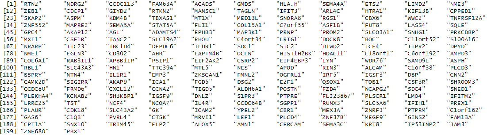
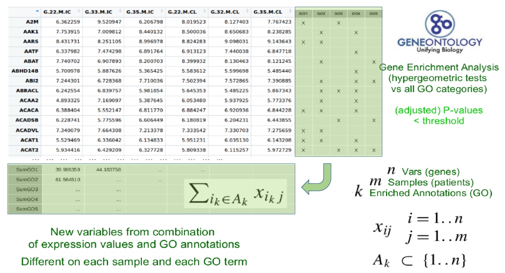
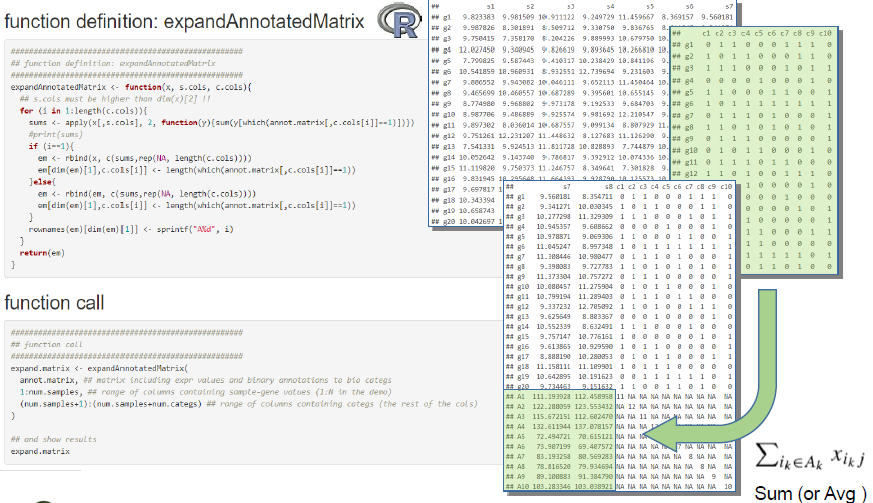
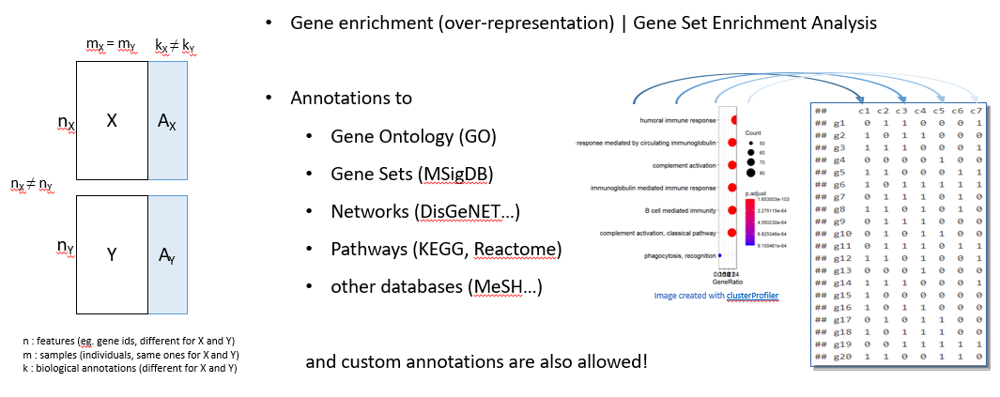
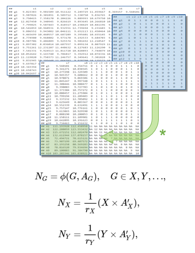
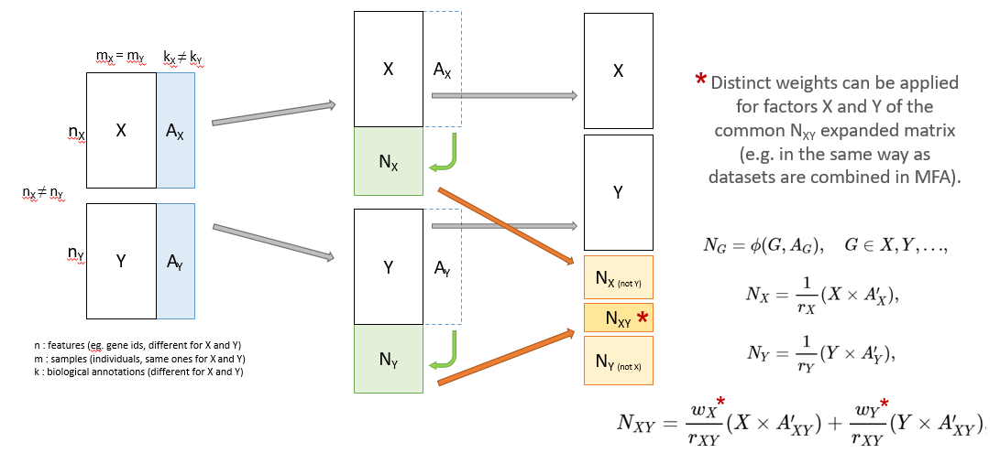
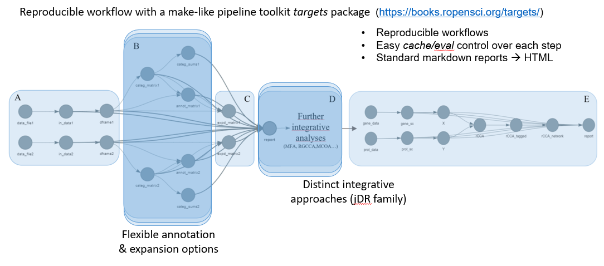

---
#########################################
# options for knitting a single chapter #
#########################################
output:
  bookdown::pdf_document2:
    template: templates/template.tex
  bookdown::html_document2: default
  bookdown::word_document2: default
documentclass: book
#bibliography: [bibliography/references.bib, bibliography/additional-references.bib]
---

```{block type='savequote', quote_author='(ref:faust-quote)', include=knitr::is_latex_output()}
Ein Mann, der recht zu wirken denkt,

Mu\ss\enspace auf das beste Werkzeug halten


_The man who seeks to be approved,_

_must stick to the best tools for it_
```
(ref:faust-quote) --- Goethe's *Faust. Eine Tragödie* (1808).

<!-- 
Notes for adding an opening quote in PDF output:
i) add the reference for the quote with the chunk option quote_author="my author name",
ii) include=knitr::opts_knit$get('rmarkdown.pandoc.to') == 'latex' means that these quotes are only included when output is latex (in HTML output, it would appear by the end of the previous page)
iii) You can't use markdown syntax inside chunk options, so if you want to e.g. italicise a book name in the quote reference use a 'text reference': Create a named piece of text with '(ref:label-name) My text', then link to this in the chunk option with quote_author='(ref:label-name)'
-->

# Methodology {#methods}
\chaptermark{Methodology}
\minitoc <!-- this will include a mini table of contents-->

## Working phases {#work-phases}
Working phases, with the corresponding steps, followed in order to achieve the above objectives:


1. Application of integrative multi-omics methods to (I) the analysis of specific data sets provided by research units from our former affiliation center, VHIR, and other research institutions that we collaborate with [@rodriguez-hernandez_cinacalcet_2016], [@rodriguez-fernandez_phosphatidylserine-liposomes_2018], [@simats_mouse_2020] and (II) to the integrative analysis of larger data sets from public data bases, such as Breast Cancer samples from the TCGA project [TCGA Research Network: http://cancergenome.nih.gov/], [TCGA-BRCA Project: https://portal.gdc.cancer.gov/projects/TCGA-BRCA].

2. Development of methods, either in terms of new algorithms or in terms of combinative workflows, which will be able to improve, and facilitate, the analysis and biological interpretation of those data sets to be integrated.

3. Implementation of the methods developed for this study in the appropriate bioinformatics tools, such as an R package or a web-based application, to facilitate their use in the context of biomedical research projects.

Here follows a brief description of these main five activities, the methods in which they are initially based, the objectives that they are related to, and the corresponding results:


1. Application of some state-of-the-art methods for integrative multi-omics data analysis to the study of human brain tissue samples, collected by the Neurovascular Diseases Laboratory at Vall d’Hebron Research Institute. This part is already finished, and led to publications in 2018 and 2021 [@simats_mouse_2020], [@ramiro_integrative_2021]. Researchers obtained different omics data from necropsies, which had been processed to obtain mRNA, microRNA and protein expression values. Each dataset had been first analyzed independently using standard bioinformatics protocols [R Development Core Team. 2008]. These analyses allowed selecting subsets of relevant features, for each type of data, to be used in the integrative analysis. Among all available options, we decided to use two distinct and complementary approaches: (I) Multiple Co-inertia Analysis implemented in Bioconductor packages made4 [@culhane_made4_2005] and mogsa [@singh_diablo_2016], and (II) Regularized Canonical Correlation Analysis with Sparse Partial Least Squares regression (sPLS), provided by mixomics R package [@rohart_mixomics_2017]. This work had been presented at some meetings [@39], [@40], [@41], [@43] and in an already published extended abstract’s series book [@brianso_integrative_2017]. This step had been obviously useful for the achievement of the objective number 3 explained in the previous section, which aims on the study of the regulome’s response to ischemic stroke, but also useful for detecting the advantages and drawbacks of the methods applied, thus setting the basis for the work regarding to objective number 2.

2. Reproduction of the same analyses steps performed in point 1) above with publicly available databases, such as distinct omics data from 150 samples from the TCGA-BRCA collection. This data set contains the expression or abundance of mRNA, miRNA and proteomics for 150 breast cancer samples previously prefiltered, as explained in Rohart et al. [29], and allows identifying a good multi-omics signature to discriminate between Basal, Her2 and Luminal A breast cancer subtypes. This work is already finished, and complies with objectives 3 and 2.

3. Use of all the data sets analyzed up to this point to make a comparison of results between the main implemented methods, and eventually some others, which is the aim of objective 1. This is based on quantitative and qualitative comparison and visualization methods, such as those explained by Thallinger [24] and Martin [25], going from simple Venn diagrams to more complex, network analysis, software such as some specific R packages [20] or Cytoscape [26]. The focus here is to use graphical visualization elements to compare the results of the analyses with and without the addition of biological information.

4. Development of new methods and/or workflows in order to improve and/or combine the benefits from the selected approaches, with focus in those allowing the addition of biological significance to the integration process. Here follows an overview of the methods developed to expand the original datasets (X, Y) with annotations (Ax, Ay) to obtain new blocks of data (Nx, Ny,and Nxy). And the workflow has been implemented adapting the integrative pipelines applied so far to the R targets package [33], a pipeline toolkit that improves reproducibility, skipping unnecessary steps already up to date and showing tangible evidence that the results match the underlying code and data. The development of this targets workflow is intended to comply with the objective number 2 of this working plan.

5. Implementation of the methods resulting from 4) as a new R package to be submitted to Bioconductor repository [27], and, finally, to complete objective 4 of this thesis plan, as a web application [28] to be used in further steps of the current biomedical research projects in which our collaborators are implied, as well as in future studies.


## Methodology

In the context of multi-omics data integration, our proposal relies on the idea that incorporating biological annotations into data sets before integrative analysis enriches outcomes and enhances their biological interpretability. So, augmenting quantitative omics data with contextual biological knowledge deepens our understanding of complex biological phenomena. To do that, we begin with meticulous data quality assessment and standardization, laying the foundation for reliable analyses. We then infuse biological knowledge using standard biological annotations, creating "Expanded Datasets" that provide context for comprehensive analysis. Advanced dimension reduction techniques can be applied then in illuminating hidden patterns and relationships between data sources or blocks and, finally, the semi-automation capabilities of the Targets R package let us to build an easy-to-use implementation of the process.


### Data Quality Assessment and Format Review

Prior to commencing the integrative analysis, a rigorous data quality assessment and format review were conducted to ensure the reliability and compatibility of the input datasets. This critical step aimed to identify and rectify any discrepancies, inconsistencies, or errors that might affect the subsequent analyses. The following procedures were employed:

* Data Source Selection: Datasets from distinct omics technologies, including genomics, transcriptomics, proteomics, and metabolomics, were obtained from reliable sources and repositories. It is essential to note that data sources were carefully selected to ensure consistency and adherence to standardized formats.

* Data Preprocessing: Raw omics data underwent preprocessing to address issues such as missing values, outliers, and data normalization. This preprocessing step was essential to enhance data quality and comparability.

* Data Format Standardization: Datasets were reviewed for consistency in data formats, including file types, column naming conventions, and units of measurement. Non-standardized data were transformed to a common format to facilitate downstream integration.

* Quality Control: Quality control checks were performed to assess the reliability of data sources. This included evaluating data reproducibility, assessing batch effects, and conducting statistical tests to identify data points or samples requiring further investigation.


### Pre-processing for Integration of Biological Knowledge: Generating the "Expanded Datasets"

The integration of biological knowledge into the omics datasets was achieved through a pre-processing step aimed at expanding the data matrices with annotations accessed from specialized R libraries, which provided direct access to curated biological databases such as Gene Ontology (GO) and pathway information (e.g., KEGG). This process resulted in what we term "Expanded Data Sets", which include the original biological features (e.g. gene expressions) as well as new variables coming from the annotation of biological  terms. The following steps detail the pre-processing procedure:

* Selected biological annotations: Specialized R libraries, dedicated to biological knowledge integration, were employed to access and retrieve up-to-date annotations from databases such as GO and KEGG.

* Data-Annotation Mapping: Each omics dataset was mapped to the retrieved biological annotations based on identifiers (e.g., gene or protein names) using the capabilities of the R libraries. This step facilitated the linking of omics data with biological knowledge.

* Annotation Integration: The annotated information accessed through the specialized R libraries was integrated into the original omics datasets, resulting in expanded data matrices that combined the original quantitative omics measurements with new quantified features associated with the given biological annotations.


PENDENT DE DETALLAR:

* Significació biològica, com faig les anotacions

* incloure aquí Biological Interpretation

* Expansió de les matrius (numeritzar anotacions, creació de noves vars a partir de les anotacions)

Start the process already having a couple [punt de millora: admetre 3 o + inputs] of data sets from distinct 'omics sources, mapped to gene ids (if GO annotation has to be performed), containing the results from a selection of differentially expressed genes or most relevant proteins analysis, or similar.

[explicar aquí els requeriments de format dels data sets d'entrada!!]

For each input data set, if annotations are not already provided, two distinct basic annotation methods can be performed:

(i) a basic GO mapping, returning annotations to those GO entities for which we find more than a certain number of features (gene ids coming from our data set) annotated to them,

[mostrar formula] [mostrar exemple]

(ii) a Gene Enrichment Analysis (based on Hypergeometric tests against all GO categories, with FDR correction[ref clusterProfiler]) is performed in order to retrieve the most relevant annotations to that set of genes/features.

[mostrar exemple de llista de gens]

```{r fig3-8, fig.align='center', fig.cap="List of gene symbols used as example", out.width="95%", echo=FALSE}

```


[afegir aquí la opció d'afegir les anotacions com a individus suplementaris enlloc de variables]


Figure \@ref(fig:fig3-1) is an example.

```{r fig3-1, fig.align='center', fig.cap="Addition of GO terms", out.width="95%", echo=FALSE}

```


Alternatively, manual annotations can be provided (eg. GO terms, canonical pathways, or even annotation to custom entities) as an optional input file. 

[mostrar el format requerit].

Other annotation methods can be implemented, as functions to be used by the main pipeline, if more complex methods for biological information addition are required.

[Mostrar el format final de les anotacions, com a matrius dels data sets amb anotacions binàries 1/0 com a columnes extra]

Once the annotations are already computed, mapping each feature of the input data set to the corresponding biological entity, they can be used to generate new features (as new rows), computing the average value [punt de millora: funció de ponderació] of the expression/intensity values from all original features being mapped to the annotated biological entities.

```{r fig3-2, fig.align='center', fig.cap="Addition of news feats", out.width="95%", echo=FALSE}

```

```{r fig3-3, fig.align='center', fig.cap="Gene enrichment diagram", out.width="95%", echo=FALSE}

```

```{r fig3-4, fig.align='center', fig.cap="Matrix expansion diagram", out.width="95%", echo=FALSE}
knitr::include_graphics("figures/chapter3/3-4_matrix_expansion_diagram.png")
```

Once we have the annotated matrices (Figure \@ref(fig:fig3-4), highlighted in blue) we proceed to generate the Expanded matrices (in green) by casting these annotations as numerical values, that is, calculating the average of the numerical expressions of each individual for the variables annotated to each category. This is done with the matrix product of the initial numerical values (expression, proteins...) with the transposed matrices of their annotations, and then with the inverse matrix of a diagonal matrix of the count of how many annotations each category or entity annotated has had.


```{r fig3-5, fig.align='center', fig.cap="Addition of new feats (2)", out.width="95%", echo=FALSE}

```

```{r fig3-6, fig.align='center', fig.cap="Matrix expansion diagram (2)", out.width="95%", echo=FALSE}

```


### Integrative Analysis with Joint Dimension Reduction Techniques

To uncover meaningful insights from the expanded data sets and extract relevant information from the integrated omics and biological knowledge, contrasted joint dimension reduction techniques were employed. These techniques enable the simultaneous analysis of multiple data types and facilitate the identification of key patterns and relationships. The following methods were applied:

* Multiple Factor Analysis (MFA): MFA, adapted for multi-omics data, was utilized to identify sources of variability in the integrated dataset while considering both quantitative omics data and biological annotations. MFA aims to maximize relevant information within the data while accounting for the hierarchical structure of the biological knowledge.

* Multiple Co-Inertia Analysis (MCIA): MCIA, a technique that aligns the covariance structures of multiple datasets, was employed to explore relationships between omics measurements and biological annotations. MCIA seeks to identify common patterns and associations between these data sources.

* Regularized Generalized Canonical Correlation Analysis (RGCCA): RGCCA was used to identify latent variables that capture joint information from omics data and biological annotations. RGCCA extends canonical correlation analysis to handle multi-view data integration and helps reveal correlated features across datasets.

PUNTS A INCLOURE: 

* Reducció de dimensió. Anàlisi factorial en detall (MFA), + MCIA + RGCCA

* incloure aquí % variabilitat explicat segons la estructura de la intersecció de les 2 taules (article Lovino 2022)

* avantatge del MFA és que podem definir blocs de variables!

* no mirem unicament si guanyem variabilitat, sino tambe si millorem interpretabilitat biologica


### Semi-Automation using the Targets R Package

The semi-automation of the integrative analysis process was facilitated by leveraging the Targets R package, which provides an efficient and user-friendly framework for building and managing complex analysis pipelines. In the development of the Targets pipeline, careful management of functions and parameters was essential to ensure a systematic and reproducible workflow. The following principles were applied:

* Function Modularity: Functions within the Targets pipeline were designed to be modular, focusing on specific tasks or analyses. This modularity enhanced code readability and maintainability.

* Parameterization: Parameters for each function and analysis step were carefully defined, allowing for flexibility and adaptability in the pipeline. This parameterization enabled the adjustment of analysis settings without modifying the underlying code.

* Dependency Management: Dependencies between different analysis steps were explicitly defined within the pipeline. This ensured that each step was executed in the correct order, and dependencies were automatically managed by the Targets package.

* Error Handling: Error handling procedures were implemented to capture and address potential issues during pipeline execution. This included the ability to handle errors, retries, and reporting of errors for troubleshooting. (NO APLICAT ARA PER ARA!)
 
PENDENT A AMPLIAR:

* Introduccio al paquet Targets en general i de les seves caracteristiques...

The R 'targets' package is a powerful tool for building and managing data science and data analysis pipelines. It is primarily designed for workflow automation, dependency management, and parallel processing in R projects. This package is useful for the following purposes:

1. Define and Manage Workflows: You can create a directed acyclic graph (DAG) that represents the workflow of your data analysis or machine learning project. Each node in the graph corresponds to a target, which can be a data file, an R script, or any other computational task.

2. Manage Dependencies: 'targets' allows you to specify dependencies between targets, ensuring that tasks are executed in the correct order. If a target depends on another target, it won't be executed until its dependencies are up-to-date.

3. Parallel Processing: One of the strengths of 'targets' is its ability to parallelize tasks. It can automatically determine which targets can be executed concurrently, improving the efficiency of your workflows, especially when working with large datasets or computationally intensive tasks.

4. Incremental Builds: When you make changes to your code or data, 'targets' can identify the minimal set of targets that need to be recomputed, saving time and computational resources. This is particularly useful for iterative development and experimentation.

5. Reports and Logging: 'targets' provides tools for generating reports and logging the progress of your workflow, making it easier to track and document your work.

6. Integration: It can be seamlessly integrated with other R packages and tools, such as 'drake' for more advanced data workflow management.

So, the 'targets' package is especially valuable for projects where data processing is a significant component, and you need a structured way to manage the various steps of your analysis or modeling pipeline. It helps ensure that your analyses are reproducible, efficient, and well-documented.

* Sistema que hem aplicat per crear el pipeline amb Targets...

```{r fig3-7, fig.align='center', fig.cap="Workflow overview", out.width="95%", echo=FALSE}

```

Targets workflow diagram (Figure \@ref(fig:fig3-7)) showing the steps corresponding with the complete process: The pipeline starts from (A) a couple of ‘omics-derived input data sets (e.g. pre-processed gene expression and protein abundance matrices). These are converted to R data frames with features in rows and samples in columns. Then, a data frame containing related annotations (B) is created, or loaded, for each given input matrix, and used to expand these original data, in order to end up with a pair of data frames (C) containing the original values plus the average expression/abundance values of the features related to each annotation as new features in additional rows. After that, distinct Dimension Reduction Methods are applied to perform the integrative analysis (D), and finally, an R markdown report (E) is rendered to show steps and main results of the full process.
