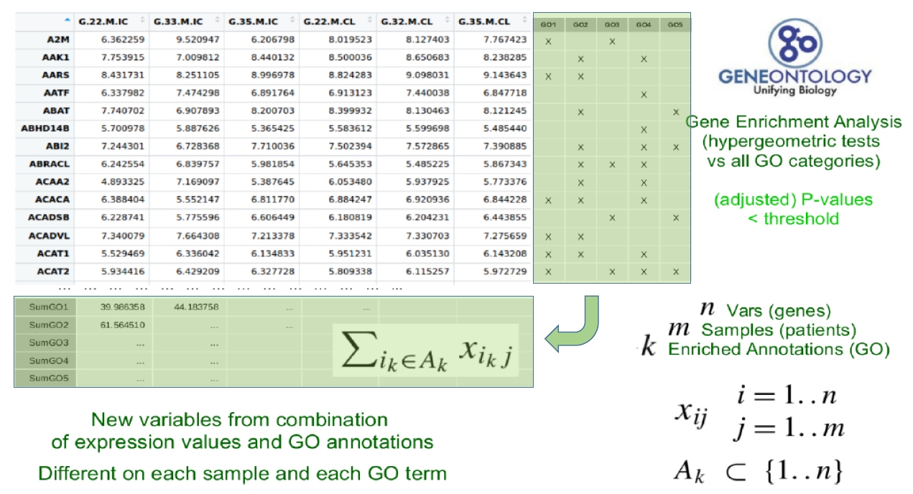

---
#########################################
# options for knitting a single chapter #
#########################################
output:
  bookdown::pdf_document2:
    template: templates/template.tex
  bookdown::html_document2: default
  bookdown::word_document2: default
documentclass: book
#bibliography: [bibliography/references.bib, bibliography/additional-references.bib]
---

```{block type='savequote', quote_author='(ref:cicero-quote)', include=knitr::is_latex_output()}
Neque porro quisquam est qui dolorem ipsum quia dolor sit amet, consectetur, adipisci velit...

There is no one who loves pain itself, who seeks after it and wants to have it, simply because it is pain...
```
(ref:cicero-quote) --- Cicero's *de Finibus Bonorum et Malorum*.

<!-- 
Notes for adding an opening quote in PDF output:
i) add the reference for the quote with the chunk option quote_author="my author name",
ii) include=knitr::opts_knit$get('rmarkdown.pandoc.to') == 'latex' means that these quotes are only included when output is latex (in HTML output, it would appear by the end of the previous page)
iii) You can't use markdown syntax inside chunk options, so if you want to e.g. italicise a book name in the quote reference use a 'text reference': Create a named piece of text with '(ref:label-name) My text', then link to this in the chunk option with quote_author='(ref:label-name)'
-->

# Methodology {#methods}
\chaptermark{Methods}
\minitoc <!-- this will include a mini table of contents-->

## Working phases {#work-phases}
Working phases, with the corresponding steps, followed in order to achieve the above objectives:


1. Application of integrative multi-omics methods to (I) the analysis of specific data sets provided by research units from our former affiliation center, VHIR, and other research institutions that we collaborate with [34, 36, 37] and (II) to the integrative analysis of larger data sets from public data bases, such as Breast Cancer samples from the TCGA project [18, 19].

2. Development of methods, either in terms of new algorithms or in terms of combinative workflows, which will be able to improve, and facilitate, the analysis and biological interpretation of those data sets to be integrated.

3. Implementation of the methods developed for this study in the appropriate bioinformatics tools, such as an R package or a web-based application, to facilitate their use in the context of biomedical research projects.

Here follows a brief description of these main five activities, the methods in which they are initially based, the objectives that they are related to, and the corresponding results:


1. Application of some state-of-the-art methods for integrative multi-omics data analysis to the study of human brain tissue samples, collected by the Neurovascular Diseases Laboratory at Vall d’Hebron Research Institute. This part is already finished, and led to publications in 2018 and 2021 [37, 38]. Researchers obtained different omics data from necropsies, which had been processed to obtain mRNA, microRNA and protein expression values. Each dataset had been first analyzed independently using standard bioinformatics protocols [20]. These analyses allowed selecting subsets of relevant features, for each type of data, to be used in the integrative analysis. Among all available options, we decided to use two distinct and complementary approaches: (I) Multiple Co-inertia Analysis implemented in Bioconductor packages made4 [21] and mogsa [22], and (II) Regularized Canonical Correlation Analysis with Sparse Partial Least Squares regression (sPLS), provided by mixomics R package [23]. This work had been presented at some meetings [39, 40, 41, 43] and in an already published extended abstract’s series book [35]. This step had been obviously useful for the achievement of the objective number 3 explained in the previous section, which aims on the study of the regulome’s response to ischemic stroke, but also useful for detecting the advantages and drawbacks of the methods applied, thus setting the basis for the work regarding to objective number 2.

2. Reproduction of the same analyses steps performed in point 1) above with publicly available databases, such as distinct omics data from 150 samples from the TCGA-BRCA collection. This data set contains the expression or abundance of mRNA, miRNA and proteomics for 150 breast cancer samples previously prefiltered, as explained in Rohart et al. [29], and allows identifying a good multi-omics signature to discriminate between Basal, Her2 and Luminal A breast cancer subtypes. This work is already finished, and complies with objectives 3 and 2.

3. Use of all the data sets analyzed up to this point to make a comparison of results between the main implemented methods, and eventually some others, which is the aim of objective 1. This is based on quantitative and qualitative comparison and visualization methods, such as those explained by Thallinger [24] and Martin [25], going from simple Venn diagrams to more complex, network analysis, software such as some specific R packages [20] or Cytoscape [26]. The focus here is to use graphical visualization elements to compare the results of the analyses with and without the addition of biological information.

4. Development of new methods and/or workflows in order to improve and/or combine the benefits from the selected approaches, with focus in those allowing the addition of biological significance to the integration process. Here follows an overview of the methods developed to expand the original datasets (X, Y) with annotations (Ax, Ay) to obtain new blocks of data (Nx, Ny,and Nxy). And the workflow has been implemented adapting the integrative pipelines applied so far to the R targets package [33], a pipeline toolkit that improves reproducibility, skipping unnecessary steps already up to date and showing tangible evidence that the results match the underlying code and data. The development of this targets workflow is intended to comply with the objective number 2 of this working plan.

5. Implementation of the methods resulting from 4) as a new R package to be submitted to Bioconductor repository [27], and, finally, to complete objective 4 of this thesis plan, as a web application [28] to be used in further steps of the current biomedical research projects in which our collaborators are implied, as well as in future studies.


## Explanation of the methods

The addition of biological annotations to the data sets being integrated, prior to the integrative analysis itself, can be useful to improve the integration/analysis outcomes as well as their biological interpretability.

Passos principals explicats aqui:

A. Pre process omics datasets in order to include biological information before the joint analysis --> Expanded datasets

B. Analysis of the expanded datasets by the use of contrasted joint Dimensionallity Reduction techniques

C. Process semi automation in ease to use tools

Start the process already having a couple [punt de millora: admetre 3 o + inputs] of data sets from distinct 'omics sources, mapped to gene ids (if GO annotation has to be performed), containing the results from a selection of differentially expressed genes or most relevant proteins analysis, or similar. [explicar aquí els requeriments de format dels data sets d'entrada!!]

For each input data set, if annotations are not already provided, two distinct basic annotation methods can be performed:

(i) a basic GO mapping, returning annotations to those GO entities for which we find more than a certain number of features (gene ids coming from our data set) annotated to them, [mostrar formula] [mostrar exemple]

(ii) a Gene Enrichment Analysis (based on Hypergeometric tests against all GO categories, with FDR correction[ref clusterProfiler]) is performed in order to retrieve the most relevant annotations to that set of genes/features. [mostrar exemple]
[afegir aquí la opció d'afegir les anotacions com a individus suplementaris enlloc de variables]


Figure \@ref(fig:fig3-1) is [this image](#fig:fig3-1).

```{r fig3-1, fig.align='center', fig.cap="Addition of GO terms", out.width="95%", echo=FALSE}

```


Alternatively, manual annotations can be provided (eg. GO terms, canonical pathways, or even annotation to custom entities) as an optional input file. [mostrar el format requerit].

Other annotation methods can be implemented, as functions to be used by the main pipeline, if more complex methods for biological information addition are required.

[Mostrar el format final de les anotacions, com a matrius dels data sets amb anotacions binàries 1/0 com a columnes extra]

Once the annotations are already computed, mapping each feature of the input data set to the corresponding biological entity, they can be used to generate new features (as new rows), computing the average value [punt de millora: ¿funció de ponderació?] of the expression/intensity values from all original features being mapped to the annotated biological entities.


## Building your entire thesis

-   Build the entire thesis by opening **index.Rmd** and clicking the 'knit' button.
-   The generated thesis files are saved in the **docs/** folder
-   To choose output formats, go to the top of **index.Rmd**'s YAML header and edit the line `thesis_formats <- "pdf";` to the format(s) you want (options are "pdf", "bs4", "gitbook", and "word")
-   You can build to multiple formats simultaneously with, e.g., `thesis_formats <- c("pdf", "bs4", "word")`
-   If you want to customise the build function, edit **scripts_and_filters/knit-functions.R**

#### PDF output

``` yaml
knit: (function(input, ...) {
    thesis_formats <- "pdf";
    ...
```

When you build the entire thesis to PDF, Latex generates a whole bunch of auxillary files - these are automatically removed after the build process end by the custom knit function that is used when you knit **index.Rmd**.

To change how this removal is done, edit **scripts_and_filters/knit-functions.R**.
The line `file.remove(list.files(pattern = "*\\.(log|mtc\\d*|maf|aux|bcf|lof|lot|out|toc)$"))` within `if ("pdf" %in% output_format){` is the one that removes files after PDF output is generated.

#### BS4 book output (HTML)

``` yaml
knit: (function(input, ...) {
    thesis_formats <- "bs4";
    ...
```

-   NOTE: the [bs4 book output](https://pkgs.rstudio.com/bookdown/reference/bs4_book.html) requires the `downlit` and `bslib` R packages (install them with `install.packages`)
-   Note also that to deploy a BS4 book on GitHub Pages, there must be a **.nojekyll** file in the **docs/** folder, otherwise GitHub does some voodoo that causes some filepaths not to work. This file is generated automatically by `oxforddown`s knitting function.

#### Gitbook output (HTML)

``` yaml
knit: (function(input, ...) {
    thesis_formats <- "gitbook";
    ...
```

-   Note that to deploy a gitbook on GitHub Pages, there must be a **.nojekyll** file in the **docs/** folder, otherwise GitHub does some voodoo that causes some filepaths not to work. This file is generated automatically by `oxforddown`s knitting function.

#### Word output

``` yaml
knit: (function(input, ...) {
    thesis_formats <- "word";
    ...
```

-   Note that the Word output has no templates behind it, and many things do not work (e.g. image rotation, highlighting corrections). **I encourage pull requests that optimise the Word output, e.g. by using tools from the [`officer`](https://github.com/davidgohel/officer) package.**

## Building a single chapter

To knit an individual chapter without compiling the entire thesis you:

1.  open the **.Rmd** file of a chapter
2.  add a YAML header specifying the output format(s) (e.g. `bookdown::word_document2` for a word document you might want to upload to Google Docs for feedback from collaborators)
3.  click the `knit` button (the output file is then saved in the root folder)

As shown in the sample chapters' YAML headers, to output a single chapter to PDF, use e.g.:

``` yaml
output:
  bookdown::pdf_document2:
    template: templates/brief_template.tex
    citation_package: biblatex
documentclass: book
bibliography: references.bib
```

The file **templates/brief_template.tex** formats the chapter in the OxThesis style but without including the front matter (table of contents, abstract, etc).


Here is a brief introduction to using *R Markdown*. 
*Markdown* is a simple formatting syntax for authoring HTML, PDF, and MS Word documents and much, much more. 
*R Markdown* provides the flexibility of *Markdown* with the implementation of **R** input and output.  For more details on using *R Markdown* see <http://rmarkdown.rstudio.com>.


## Basic markdown syntax
### Whitespace
Be careful with your spacing. 
While whitespace largely is ignored, it does at times give markdown signals as to how to proceed. 
As a habit, try to keep everything left aligned whenever possible, especially as you type a new paragraph. 
In other words, there is no need to indent basic text in the Rmd document (in fact, it might cause your text to do funny things if you do).

### Italics and bold
- *Italics* are done like \*this\* or \_this\_
- **Bold** is done like \*\*this\*\* or \_\_this\_\_
- **_Bold and italics_** is done like \*\*\*this\*\*\*, \_\_\_this\_\_\_, or (the most transparent solution, in my opinion) \*\*\_this\_\*\*

### Inline code
- `Inline code` is created with backticks like `` `this` ``

### Sub and superscript 
Sub~2~ and super^2^ script is created like this\~2\~ and this\^2\^

### Strikethrough
- ~~Strikethrough~~ is done \~\~like this\~\~

### 'Escaping' (aka "What if I need an actual asterisk?")
- To include an actual \*, \_ or \\, add another \\ in front of them: \\\*, \\\_, \\\\

### Endash (--), emdash (---)
- -- and --- with \-\- and \-\-\-

### Blockquotes
Do like this:

> Put a \> in front of the line.

### Headings
Section headers are created with \#'s of increasing number, i.e. 
  
- \# First-level heading
- \#\# Second-level heading
- \#\#\# Etc.

In PDF output, a level-five heading will turn into a paragraph heading, i.e. `\paragraph{My level-five heading}`, which appears as bold text on the same line as the subsequent paragraph.


### Lists
Unordered list by starting a line with an \* or a \-:

* Item 1
* Item 2

Ordered lists by starting a line with a number.
Notice that you can mislabel the numbers and *Markdown* will still make the order right in the output:

1. Item 1
4. Item 2


To create a sublist, indent the values a bit (at least four spaces or a tab):

1. Item 1
1. Item 2
1. Item 3
    - Item 3a
    - Item 3b

### Line breaks

The official *Markdown* way to create line breaks is by ending a line with more than two spaces.

Roses are red.
Violets are blue.

This appears on the same line in the output, because we didn't add spaces after red.

Roses are red.   
Violets are blue.

This appears with a line break because I added spaces after red.

I find this is confusing, so I recommend the alternative way: Ending a line with a backslash will also create a linebreak:

Roses are red.\
Violets are blue.

To create a new paragraph, you put a blank line.

Therefore, this line starts its own paragraph.

### Hyperlinks
- [This is a hyperlink](https://www.google.com) created by writing the text you want turned into a clickable link in `[square brackets followed by a](https://hyperlink-in-parentheses)`

### Footnotes
- Are created^[my footnote text] by writing either \^[my footnote text] for supplying the footnote content inline, or something like `[^a-random-footnote-label]` and supplying the text elsewhere in the format shown below [^test-footnote]:

`[^a-random-footnote-label]: This is a random test.`

[^test-footnote]: This is a random test.

### Comments
To write comments within your text that won't actually be included in the output, use the same syntax as for writing comments in HTML. That is, \<!\-\- this will not be included in the output \-\->.

<!-- It is super useful to use comments! -->

### Math
The syntax for writing math is stolen from LaTeX. To write a math expression that will be shown **inline**, enclose it in dollar signs.
  - This: \$A = \\pi*r^{2}\$  Becomes: $A = \pi*r^{2}$
  
To write a math expression that will be shown in a block, enclose it in two dollar signs.\
This: `r ifelse(knitr::opts_knit$get('rmarkdown.pandoc.to') == 'latex', "\\$\\$A = \\\\pi*r^{2}\\$\\$", "<span>&#36;</span>\\$A = \\\\pi*r^{2}\\$\\$")`

Becomes: 
$$A = \pi*r^{2}$$

To create numbered equations, put them in an 'equation' environment and give them a label with the syntax `(\#eq:label)`, like this:

```latex
\begin{equation} 
  f\left(k\right) = \binom{n}{k} p^k\left(1-p\right)^{n-k}
  (\#eq:binom)
\end{equation} 
```

Becomes:
\begin{equation}
f\left(k\right)=\binom{n}{k}p^k\left(1-p\right)^{n-k}
(\#eq:binom)
\end{equation}


For more (e.g. how to theorems), see e.g. the documentation on [bookdown.org](https://bookdown.org/yihui/bookdown/markdown-extensions-by-bookdown.html#equations)


