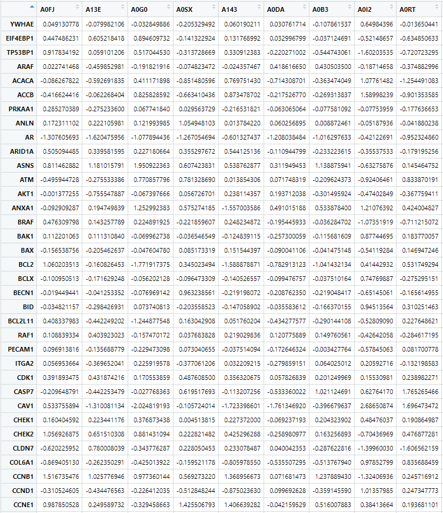
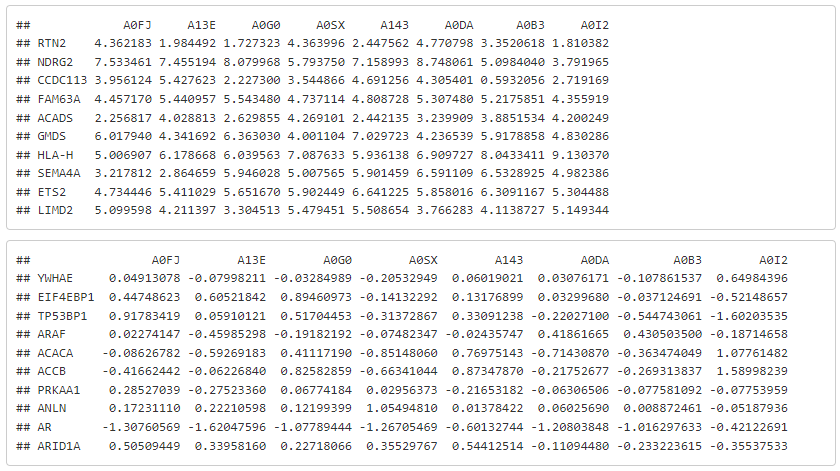
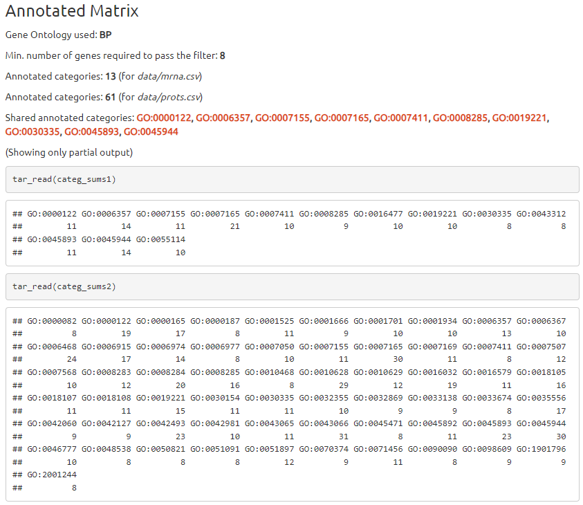
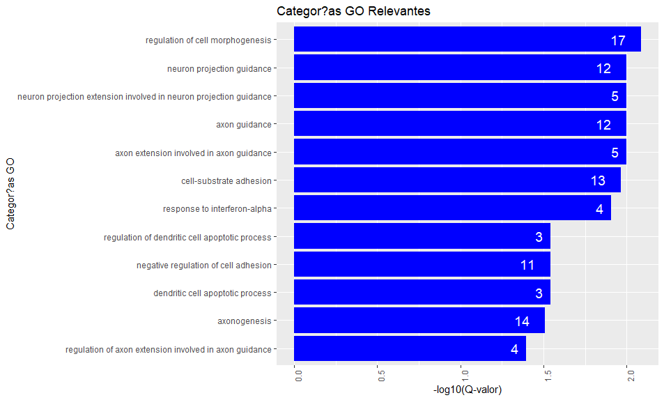

---
#########################################
# options for knitting a single chapter #
#########################################
output:
  bookdown::pdf_document2:
    template: templates/template.tex
  bookdown::html_document2: default
  bookdown::word_document2: default
documentclass: book
#bibliography: [bibliography/references.bib, bibliography/additional-references.bib]
---

```{block type='savequote', quote_author='(ref:faust-quote)', include=knitr::is_latex_output()}
Ein Mann, der recht zu wirken denkt,

Mu\ss\enspace auf das beste Werkzeug halten


_The man who seeks to be approved,_

_must stick to the best tools for it_
```
(ref:faust-quote) --- Goethe's *Faust. Eine Tragödie* (1808).

<!-- 
Notes for adding an opening quote in PDF output:
i) add the reference for the quote with the chunk option quote_author="my author name",
ii) include=knitr::opts_knit$get('rmarkdown.pandoc.to') == 'latex' means that these quotes are only included when output is latex (in HTML output, it would appear by the end of the previous page)
iii) You can't use markdown syntax inside chunk options, so if you want to e.g. italicise a book name in the quote reference use a 'text reference': Create a named piece of text with '(ref:label-name) My text', then link to this in the chunk option with quote_author='(ref:label-name)'
-->

# Methodology {#methods}
\chaptermark{Methodology}
\minitoc <!-- this will include a mini table of contents-->

In the context of multi-omics data integration, our proposal relies on the idea that incorporating biological annotations into datasets before proceeding with integrative analysis enriches the outcomes and enhances their biological interpretability. Therefore, augmenting quantitative omics data with contextual biological knowledge will deepen our understanding of complex biological phenomena. To do so, we begin with meticulous data quality assessment and standardization, laying the foundation for reliable analyses. We then infuse biological knowledge using standard biological annotations, creating "Expanded Datasets" that provide context for comprehensive analysis. Advanced dimension-reduction techniques can be applied to illuminate hidden patterns and relationships between data sources or blocks, and the semi-automation capabilities of the Targets R package allow us to build an easy-to-use implementation of the whole process.


## Data Format Review and Quality Assessment {#qa}

Before initiating the integrative analysis, a meticulous evaluation of data quality and format compatibility was conducted to ensure the reliability of the input datasets. This crucial step aimed to identify and rectify discrepancies, inconsistencies, or errors that could potentially impact subsequent analyses. During this process, datasets spanning various omics technologies, including transcriptomics and proteomics, are selectively acquired from reputable sources and repositories. Emphasis was placed on meticulous source selection to guarantee consistency and adherence to standardized formats. Subsequently, the raw omics data underwent a comprehensive preprocessing phase, addressing issues such as missing values, outliers, and normalization. This preprocessing step was indispensable for enhancing data quality and enabling comparability across diverse datasets. Additionally, a thorough review of data formats encompassing file types, column naming conventions, and units of measurement was conducted. Non-standardized data were systematically transformed into a uniform format to streamline the downstream integration processes. Through these procedures, a robust foundation was established for subsequent integrative omics analysis, ensuring coherence and validity of the synthesized biomedical insights.

Data, whether obtained directly from TCGA or from specific data sets used as examples in specific R packages[data source: http://mixomics.org/mixdiablo/diablo-tcga-case-study/], has to be reviewed by performing a basic descriptive analysis, as is customary in single-omics data studies.


Data source:
The Cancer Genome Atlas Network (Network et al., 2012)
veure [@koboldt_comprehensive_2012]
data original source: https://portal.gdc.cancer.gov/projects/TCGA-BRCA

BRCA subtypes main ref: https://www.pnas.org/doi/full/10.1073/pnas.191367098
veure[@sorlie_gene_2001]

The Cancer Genome Atlas, often abbreviated as TCGA,  is a landmark project  funded by the National Cancer Institute (NCI) and the National Human Genome Research Institute (NHGRI) in the United States. 
It's a joint effort  to comprehensively understand the molecular basis of cancer by using genome analysis technologies.
TCGA curates a vast collection of real-world data, covering diverse cancer types. 
This data encompasses omics datasets, such as transcriptomics and proteomics, offering researchers a comprehensive perspective on the molecular landscape of tumors.
Stringent quality control and standardization measures ensure the data within TCGA is compatible and readily integrable with other datasets. 
This facilitates robust multi-omics analyses, and such approach ensures data Compatibility, given that standardized formats eliminate inconsistencies between datasets generated using different platforms or technologies. 
This also allows for seamless integration of data from various sources, crucial for multi-omics analyses like the one presented in this thesis. 
The integration of transcriptomics and proteomics data, heavily relies on the ability to combine these kind of datasets for a more holistic understanding. Standardized formats within TCGA remove a significant hurdle in this process.
In addition to that, standardized data collection and processing protocols minimize technical variations that could introduce bias into the data, therefore enhancing the reliability and generalizability of findings derived from TCGA records. 
The public availability of TCGA data empowers researchers worldwide to leverage this rich resource in their investigations and, consequently, this fosters open science collaborations and accelerates advancements in cancer research.


In the vast majority of cases, the information is structured directly in tables or matrices (where, for example, the columns contain patient samples or experimental individuals, while the rows represent the values of the measured features). These matrices can be encapsulated in structures such as Expression Sets or similar, where information about the omic measurements is accompanied by metadata related to the samples themselves or to the details of the technology used for the analysis.


FFF:Nota d'exemple de dades
*Samples in rows (200G, 111P); *
*Features in columns (150S). *
*Tenim dimensions de 200 x 150 per una banda i 111(154 originalment) x 150 per l'altra.*


It is relatively frequent that the datasets available for multi-omics studies present information on the same samples, analyzed by means of two or more different technologies (e.g., microarrays or RNA-seq for mRNA gene expression, plus quantification for proteins) while the information related to the omic molecules analyzed is, obviously, different. Not only that, but it is also common that there is no direct mapping between the different types of features, so that, for example, not all genes analyzed in an RNA expression experiment are unambiguously represented by their corresponding proteins.

The task of recognizing the labels of the molecules analyzed in each dataset and consequently determining which ones are suitable for proceeding with the integrative analysis is not a light one. It often requires to implement a semi-automatic general identification of their names or ID codes, followed by a validation and filtering of the resulting non-obvious cases. If, in addition, the integrative analysis aims to map the different omics in some way at the biological process level (e.g., microRNAs against their target genes), then we are faced with an additional challenge of critical importance for the rest of the process.


*Mostrar Figure \@ref(fig:fig3-10) i Figure \@ref(fig:fig3-9) PERO POTSER MILLOR COM A TAULES INTEGRADES AMB MARKDOWN?*

\clearpage


```{r fig3-9, fig.align='center', fig.scap="Example of proteomics input data", fig.cap="Example of proteomics input data, viewed as a table in RStudio", out.width="95%", echo=FALSE}

```

```{r fig3-10, fig.align='center', fig.scap="Example of gene and protein data loaded in R", fig.cap="Example of gene expression (above) and protein quantification raw data (below), viewed as loaded arrays in R", out.width="95%", echo=FALSE}

```


\clearpage


*COMENTAR TAMBE REQUERIMENTS DE FORMAT (headers, value types...)*

*EXPLICAR QUALITY CHECKS APLICATS (grafiques per deteccio d'outliers, data centering...)*


```{r fig3-13, fig.align='center', fig.show='hold', fig.scap="Transcriptomics values before and after centering", fig.cap="Histogram of the gene expression values coming from TCGA-BRCA dataset, before (left) and after (right) data centering", out.width="48%", echo=FALSE}
knitr::include_graphics(c("figures/chapter3/3-13a_mrna_data_unscaled.png","figures/chapter3/3-13b_mrna_data_scaled.png"))
```

*El proces s'ha de repetir, obviament, amb tots els input datasets.*

\clearpage


## Preprocessing for Integration of Biological Knowledge {#preprocess}

The integration of biological knowledge into omics datasets can be achieved through a preprocessing step aimed at expanding the original data matrices with annotations accessed from specialized R libraries, which provided direct access to curated biological databases such as the Gene Ontology[@ashburner_gene_2000],[@thegeneontologyconsortium_gene_2019] and biochemical pathways information (e.g., KEGG[@kanehisa_kegg_2000]). This process, that combines the annotation of the most significant biological entities with the quantification and integration of their annotation values to the data matrices, ends up with what we term "Expanded Datasets", which include the original biological features (e.g., gene expression or protein quantification values) as well as new variables coming from the annotation of biological  terms. The following steps explain this preprocessing procedure in more detail:


* Selection of biological knowledge sources to feed annotations. Starting from the most commonly used biological knowledge databases in tasks of omics data analysis and interpretation, the goal is to access those that are most complete and applicable to the different types of data that must be annotated. GO and KEGG are excellent choices for that purpose.

* Selection of R packages specialized in the integration of biological information. The choice of the appropriate packages for the integration of biological information will depend on the specific needs of the project. In general, it is important to consider factors such as the type of data that will be integrated, the sources of the data, the integration methods that will be used and the desired level of complexity. In this case, it is appropriate to use R packages that can work with gene and protein identifiers reliably and completely, without adding too much complexity to the process.

* Data-Annotation Mapping. Each omics dataset is mapped to the biological information collected based on its identifiers (for example, gene or protein names) using the capabilities of the selected R packages. This step facilitates the relationship of each of the elements of the omics data with the biological knowledge entities, creating certain temporary objects that collect the information of these links. So this step allows to relate the elements of omics data with biological knowledge entities, such as genes, proteins, metabolic pathways, etc. The mapping is performed using the identifiers of the elements of the omics data. For example, genes can be identified by their name, their symbol, or their Ensembl ID. Proteins can be identified by their name, their sequence, or their UniProt ID.

* Annotation Integration. The most relevant annotation elements resulting from the previous step can be integrated into the matrix structure of the original omics dataset that has been used for its biological annotation, resulting in an expanded data matrix that combines the initial quantitative omics measurements with new values associated with the biological annotations obtained in the process. This step is implemented by executing new R functions specifically developed for this purpose. The resulting data matrices (which contain the integration of the most relevant biological annotations) are called 'Expanded Matrices', and will be the basis for the subsequent application of integrative analysis methods of the different omics analyzed.

### Selection of the sources for biological annotation {#biosources}
Selecting biological information sources for annotations hinges on various criteria: source credibility, information comprehensiveness, content currency, data format standardization, data accessibility, and potentially other relevant considerations like reputation and community acceptance. In the context of the present work, Source Credibility is the reliability and trustworthiness of the source providing the biological information; Comprehensiveness of Information is taken as the breadth and depth of the information contained within the source; Content Currency is the timeliness and up-to-date nature of the information provided; 
Data Format Standardization is the adherence to standardized data formats for ease of integration and analysis; and Data Accessibility is considered as the ease of obtaining and accessing the data from each specific source. Other relevant criteria, such as community acceptance, is also a must to be taken into account.

*Apuntar que es poden facilitar ja anotacions disponibles prèviament, sempre que compleixin amb el format que s'explica al següent apartat. *

From the outset, our method was designed to allow the integration of user-prepared annotations, provided they adhered to the specified formats. This flexibility enabled users to leverage their existing knowledge and annotations, seamlessly incorporating them into our framework for enhanced analysis.

These annotations could be provided in either standard formats or customized according to user preferences. However, it is important to note that customized annotations that deviate from standard nomenclatures may not be compatible with certain functionalities of the proposed solution. Therefore, adhering to standard formats is recommended to ensure optimal compatibility and better integration.

\clearpage

### Selection of the annotation packages {#biopackages}
*PAS QUE ES FA PRACTICAMENT AL MATEIX TEMPS QUE L'ANTERIOR*

*Destacar criteris de fiabilitat i senzillesa*

*Apuntar llista o referencia principal important*


### Biological annotations mapping {#bioannotation}
FFF: COM VAM PLANTEJAR fer l'anotació biologica. Quines opcions i amb quins metodes estadístics/bioinformatics...
FFF: DUBTO SI LO QUE SEGUEIX NO ANIRIA A RESULTATS

For each input dataset, if annotations are not already provided, two distinct basic annotation methods can be performed:

(i) a basic GO mapping, returning annotations to those GO entities for which we find more than a certain number of features (gene ids coming from our dataset, see Figure \@ref(fig:fig3-8) for an example) annotated to them, 

(ii) a Gene Enrichment Analysis (based on Hypergeometric tests against all GO categories, with FDR correction) is performed in order to retrieve the most relevant annotations to that set of genes/features.[@yu_clusterprofiler_2012]

Figure \@ref(fig:fig3-8) illustrates an example of a Gene List, where Gene Symbols serve as the standard nomenclature identifiers. These symbols represent unique identifiers for specific genes and are crucial for maintaining consistent gene identification across different species and databases. The use of standardized Gene Symbols ensures clear communication and facilitates data sharing among researchers. While figure \@ref(fig:fig3-11) showcases the outcome of annotating the previous Gene List against the Biological Processes (BP terms) of the Gene Ontology (GO). This process involves assigning GO terms to each gene based on its known biological function. GO terms provide a structured and hierarchical vocabulary for describing gene functions, enabling researchers to effectively organize, analyze, and compare gene functions across various organisms.


```{r fig3-8, fig.align='center', fig.cap="List of gene symbols used as example", out.width="95%", echo=FALSE}
knitr::include_graphics("figures/chapter3/3-8_gene_list.png")
```


```{r fig3-11, fig.align='center', fig.scap="Example of basic GO annotation by raw count", fig.cap="Example of basic Go annotation by raw count against GO Biological Processes, setting 8 as minimum number of genes included in the BP entity. Annotation performed separately for gene expression and protein quantification input files", out.width="95%", echo=FALSE}

```

In figure \@ref(fig:fig3-11) we can see the number of Go terms resulting from the the process, given the specified threshold, for both gene expression and protein data sets, as well as the list of GO Ids returned as result (such as "GO:0007155", which refers to "cell adhesion" process and is present in the GO terms returned for both data types, with 11 target gene symbols annotated in both cases).


```{r fig3-12, fig.align='center', fig.scap="Example of results from GO annotation", fig.cap="Example of results from GO annotation. Results of the biological significance analysis performed with the lists of genes against GO through clusterProfiler", out.width="95%", echo=FALSE}

```

Figure \@ref(fig:fig3-12) presents a graphical representation of the results obtained by processing the same gene list used in the previous examples with the R package clusterProfiler[@yu_clusterprofiler_2012]. This visualization showcases the outcomes of the biological significance analysis performed against the GO categories. clusterProfiler is an R package that automates the process of biological-term classification and the enrichment analysis of gene clusters. The analysis module and visualization module were combined into a reusable workflow, and currently supports three species, including humans, mice, and yeast. In this case, the graphical representation effectively communicates the identified enriched GO terms and their associated significance levels, providing valuable insights into the underlying biological processes associated with the gene list. 

*FFF: [mostrar formula estadística emprada per les anotacions] *

*FFF: [punt de millora, que l'anotacio basica pugui ser tb a KEGG]*

*FFF: COMENTAR AQUI l'opció d'afegir les anotacions com a individus suplementaris enlloc de variables¿?*


\clearpage


```{r fig3-1, fig.align='center', fig.cap="Addition of GO terms", out.width="95%", echo=FALSE}
knitr::include_graphics("figures/chapter3/3-1_addition_of_GO_terms.png")
```


Alternatively, manual annotations can be provided (eg. GO terms, canonical pathways, or even annotation to custom entities) as an optional input file. 

FFF: [mostrar el format requerit].

Other annotation methods can be implemented, as functions to be used by the main pipeline, if more complex methods for biological information addition are required.

FFF: [Mostrar el format final de les anotacions, com a matrius dels datasets amb anotacions binàries 1/0 com a columnes extra]


FFF: EXPANSIO DE LES MATRIUS (numeritzar anotacions, creació de noves vars a partir de les anotacions)

The process starts already having a couple of datasets from distinct 'omics sources [punt de millora: admetre 3 o + inputs, comentar més tard a Discussion], mapped to gene ids (in the default case, where GO annotation have been performed), containing the results from a selection of differentially expressed genes or most relevant proteins analysis, or similar.

\clearpage

### Annotation Integration {#biointegration}

Once the annotations are already computed, mapping each feature of the input dataset to the corresponding biological entity, they can be used to generate new features (as new rows), computing the average value [punt de millora: funció de ponderació] of the expression/intensity values from all original features being mapped to the annotated biological entities.

```{r fig3-2, fig.align='center', fig.cap="Addition of news feats", out.width="95%", echo=FALSE}
knitr::include_graphics("figures/chapter3/3-2_addition_of_new_feats.png")
```

```{r fig3-3, fig.align='center', fig.cap="Gene enrichment diagram", out.width="95%", echo=FALSE}
knitr::include_graphics("figures/chapter3/3-3_gene_enrichment_diagram.png")
```

```{r fig3-4, fig.align='center', fig.cap="Matrix expansion diagram", out.width="95%", echo=FALSE}
knitr::include_graphics("figures/chapter3/3-4_matrix_expansion_diagram.png")
```

Once we have the annotated matrices (Figure \@ref(fig:fig3-4), highlighted in blue) we proceed to generate the Expanded matrices (in green) by casting these annotations as numerical values, that is, calculating the average of the numerical expressions of each individual for the variables annotated to each category. This is done with the matrix product of the initial numerical values (expression, proteins...) with the transposed matrices of their annotations, and then with the inverse matrix of a diagonal matrix of the count of how many annotations each category or entity annotated has had.


```{r fig3-5, fig.align='center', fig.cap="Addition of new feats (2)", out.width="95%", echo=FALSE}
knitr::include_graphics("figures/chapter3/3-5_addition_of_new_feats_2.png")
```

```{r fig3-6, fig.align='center', fig.cap="Matrix expansion diagram (2)", out.width="95%", echo=FALSE}
knitr::include_graphics("figures/chapter3/3-6_matrix_expansion_diagram_2.png")
```


## Integrative Analysis with Joint Dimension Reduction Techniques

To uncover meaningful insights from the expanded datasets and extract relevant information from the integrated omics and biological knowledge, contrasted joint dimension reduction techniques were employed. These techniques enable the simultaneous analysis of multiple data types and facilitate the identification of key patterns and relationships. The following methods were applied:

* Multiple Factor Analysis (MFA): MFA, adapted for multi-omics data, was utilized to identify sources of variability in the integrated dataset while considering both quantitative omics data and biological annotations. MFA aims to maximize relevant information within the data while accounting for the hierarchical structure of the biological knowledge.

* Multiple Co-Inertia Analysis (MCIA): MCIA, a technique that aligns the covariance structures of multiple datasets, was employed to explore relationships between omics measurements and biological annotations. MCIA seeks to identify common patterns and associations between these data sources.

* Regularized Generalized Canonical Correlation Analysis (RGCCA): RGCCA was used to identify latent variables that capture joint information from omics data and biological annotations. RGCCA extends canonical correlation analysis to handle multi-view data integration and helps reveal correlated features across data sets.

FFF: PUNTS A INCLOURE: 

* Reducció de dimensió. Anàlisi factorial en detall (MFA), + MCIA + RGCCA

* incloure aquí % variabilitat explicat segons la estructura de la intersecció de les 2 taules [@lovino_survey_2021]

* avantatge del MFA és que podem definir blocs de variables!

* no mirem unicament si guanyem variabilitat, sino tambe si millorem interpretabilitat biologica


## Semi-Automation using the Targets R Package

The semi-automation of the integrative analysis process was facilitated by leveraging the *Targets* R package, which provides an efficient and user-friendly framework for building and managing complex analysis pipelines. In the development of the *Targets* pipeline, careful management of functions and parameters was essential to ensure a systematic and reproducible workflow. The following principles were applied:

* Function Modularity: Functions within the Targets pipeline were designed to be modular, focusing on specific tasks or analyses. This modularity enhanced code readability and maintainability.

* Parameterization: Parameters for each function and analysis step were carefully defined, allowing for flexibility and adaptability in the pipeline. This parameterization enabled the adjustment of analysis settings without modifying the underlying code.

* Dependency Management: Dependencies between different analysis steps were explicitly defined within the pipeline. This ensured that each step was executed in the correct order, and dependencies were automatically managed by the Targets package.

* Error Handling: Error handling procedures were implemented to capture and address potential issues during pipeline execution. This included the ability to handle errors, retries, and reporting of errors for troubleshooting. 
FFF: (NO APLICAT ARA PER ARA!)
 
FFF: PENDENT A AMPLIAR:

* FFF: Introduccio al paquet Targets en general i de les seves caracteristiques...

The R 'targets' package is a powerful tool for building and managing data science and data analysis pipelines. It is primarily designed for workflow automation, dependency management, and parallel processing in R projects. This package is useful for the following purposes:

1. Define and Manage Workflows: You can create a directed acyclic graph (DAG) that represents the workflow of your data analysis or machine learning project. Each node in the graph corresponds to a target, which can be a data file, an R script, or any other computational task.

2. Manage Dependencies: 'targets' allows you to specify dependencies between targets, ensuring that tasks are executed in the correct order. If a target depends on another target, it won't be executed until its dependencies are up-to-date.

3. Parallel Processing: One of the strengths of 'targets' is its ability to parallelize tasks. It can automatically determine which targets can be executed concurrently, improving the efficiency of your workflows, especially when working with large data sets or computationally intensive tasks.

4. Incremental Builds: When you make changes to your code or data, 'targets' can identify the minimal set of targets that need to be recomputed, saving time and computational resources. This is particularly useful for iterative development and experimentation.

5. Reports and Logging: 'targets' provides tools for generating reports and logging the progress of your workflow, making it easier to track and document your work.

6. Integration: It can be seamlessly integrated with other R packages and tools, such as 'drake' for more advanced data workflow management.

So, the 'targets' package is especially valuable for projects where data processing is a significant component, and you need a structured way to manage the various steps of your analysis or modeling pipeline. It helps ensure that your analyses are reproducible, efficient, and well-documented.

* FFF: Sistema que hem aplicat per crear el pipeline amb Targets...

```{r fig3-7, fig.align='center', fig.cap="Workflow overview", out.width="95%", echo=FALSE}
knitr::include_graphics("figures/chapter3/3-7_workflow_overview.png")
```

Targets workflow diagram (Figure \@ref(fig:fig3-7)) showing the steps corresponding with the complete process: The pipeline starts from (A) a couple of ‘omics-derived input datasets (e.g. pre-processed gene expression and protein abundance matrices). These are converted to R data frames with features in rows and samples in columns. Then, a data frame containing related annotations (B) is created, or loaded, for each given input matrix, and used to expand these original data, in order to end up with a pair of data frames (C) containing the original values plus the average expression/abundance values of the features related to each annotation as new features in additional rows. After that, distinct Dimension Reduction Methods are applied to perform the integrative analysis (D), and finally, an R markdown report (E) is rendered to show steps and main results of the full process.
