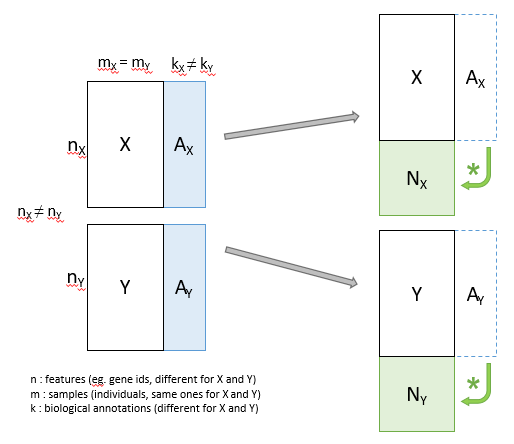

---
#########################################
# options for knitting a single chapter #
#########################################
output:
  bookdown::pdf_document2:
    template: templates/template.tex
  bookdown::html_document2: default
  bookdown::word_document2: default
documentclass: book
#bibliography: [bibliography/references.bib, bibliography/additional-references.bib]
---

```{block type='savequote', quote_author='(ref:cicero-quote)', include=knitr::is_latex_output()}
Neque porro quisquam est qui dolorem ipsum quia dolor sit amet, consectetur, adipisci velit...

There is no one who loves pain itself, who seeks after it and wants to have it, simply because it is pain...
```
(ref:cicero-quote) --- Cicero's *de Finibus Bonorum et Malorum*.

<!-- 
Notes for adding an opening quote in PDF output:
i) add the reference for the quote with the chunk option quote_author="my author name",
ii) include=knitr::opts_knit$get('rmarkdown.pandoc.to') == 'latex' means that these quotes are only included when output is latex (in HTML output, it would appear by the end of the previous page)
iii) You can't use markdown syntax inside chunk options, so if you want to e.g. italicise a book name in the quote reference use a 'text reference': Create a named piece of text with '(ref:label-name) My text', then link to this in the chunk option with quote_author='(ref:label-name)'
-->

# Methodology {#methods}
\chaptermark{Methodology}
\minitoc <!-- this will include a mini table of contents-->

## Working phases {#work-phases}
Working phases, with the corresponding steps, followed in order to achieve the above objectives:


1. Application of integrative multi-omics methods to (I) the analysis of specific data sets provided by research units from our former affiliation center, VHIR, and other research institutions that we collaborate with [34, 36, 37] and (II) to the integrative analysis of larger data sets from public data bases, such as Breast Cancer samples from the TCGA project [18, 19].

2. Development of methods, either in terms of new algorithms or in terms of combinative workflows, which will be able to improve, and facilitate, the analysis and biological interpretation of those data sets to be integrated.

3. Implementation of the methods developed for this study in the appropriate bioinformatics tools, such as an R package or a web-based application, to facilitate their use in the context of biomedical research projects.

Here follows a brief description of these main five activities, the methods in which they are initially based, the objectives that they are related to, and the corresponding results:


1. Application of some state-of-the-art methods for integrative multi-omics data analysis to the study of human brain tissue samples, collected by the Neurovascular Diseases Laboratory at Vall d’Hebron Research Institute. This part is already finished, and led to publications in 2018 and 2021 [37, 38]. Researchers obtained different omics data from necropsies, which had been processed to obtain mRNA, microRNA and protein expression values. Each dataset had been first analyzed independently using standard bioinformatics protocols [20]. These analyses allowed selecting subsets of relevant features, for each type of data, to be used in the integrative analysis. Among all available options, we decided to use two distinct and complementary approaches: (I) Multiple Co-inertia Analysis implemented in Bioconductor packages made4 [21] and mogsa [22], and (II) Regularized Canonical Correlation Analysis with Sparse Partial Least Squares regression (sPLS), provided by mixomics R package [23]. This work had been presented at some meetings [39, 40, 41, 43] and in an already published extended abstract’s series book [35]. This step had been obviously useful for the achievement of the objective number 3 explained in the previous section, which aims on the study of the regulome’s response to ischemic stroke, but also useful for detecting the advantages and drawbacks of the methods applied, thus setting the basis for the work regarding to objective number 2.

2. Reproduction of the same analyses steps performed in point 1) above with publicly available databases, such as distinct omics data from 150 samples from the TCGA-BRCA collection. This data set contains the expression or abundance of mRNA, miRNA and proteomics for 150 breast cancer samples previously prefiltered, as explained in Rohart et al. [29], and allows identifying a good multi-omics signature to discriminate between Basal, Her2 and Luminal A breast cancer subtypes. This work is already finished, and complies with objectives 3 and 2.

3. Use of all the data sets analyzed up to this point to make a comparison of results between the main implemented methods, and eventually some others, which is the aim of objective 1. This is based on quantitative and qualitative comparison and visualization methods, such as those explained by Thallinger [24] and Martin [25], going from simple Venn diagrams to more complex, network analysis, software such as some specific R packages [20] or Cytoscape [26]. The focus here is to use graphical visualization elements to compare the results of the analyses with and without the addition of biological information.

4. Development of new methods and/or workflows in order to improve and/or combine the benefits from the selected approaches, with focus in those allowing the addition of biological significance to the integration process. Here follows an overview of the methods developed to expand the original datasets (X, Y) with annotations (Ax, Ay) to obtain new blocks of data (Nx, Ny,and Nxy). And the workflow has been implemented adapting the integrative pipelines applied so far to the R targets package [33], a pipeline toolkit that improves reproducibility, skipping unnecessary steps already up to date and showing tangible evidence that the results match the underlying code and data. The development of this targets workflow is intended to comply with the objective number 2 of this working plan.

5. Implementation of the methods resulting from 4) as a new R package to be submitted to Bioconductor repository [27], and, finally, to complete objective 4 of this thesis plan, as a web application [28] to be used in further steps of the current biomedical research projects in which our collaborators are implied, as well as in future studies.


## Explanation of the methods

The addition of biological annotations to the data sets being integrated, prior to the integrative analysis itself, can be useful to improve the integration/analysis outcomes as well as their biological interpretability.

Passos principals explicats aqui:

A. Pre process omics datasets in order to include biological information before the joint analysis --> Expanded datasets

B. Analysis of the expanded datasets by the use of contrasted joint Dimensionallity Reduction techniques

C. Process semi automation in ease to use tools

Start the process already having a couple [punt de millora: admetre 3 o + inputs] of data sets from distinct 'omics sources, mapped to gene ids (if GO annotation has to be performed), containing the results from a selection of differentially expressed genes or most relevant proteins analysis, or similar. [explicar aquí els requeriments de format dels data sets d'entrada!!]

For each input data set, if annotations are not already provided, two distinct basic annotation methods can be performed:

(i) a basic GO mapping, returning annotations to those GO entities for which we find more than a certain number of features (gene ids coming from our data set) annotated to them, [mostrar formula] [mostrar exemple]

(ii) a Gene Enrichment Analysis (based on Hypergeometric tests against all GO categories, with FDR correction[ref clusterProfiler]) is performed in order to retrieve the most relevant annotations to that set of genes/features. [mostrar exemple]
[afegir aquí la opció d'afegir les anotacions com a individus suplementaris enlloc de variables]


Figure \@ref(fig:fig3-1) is an example.

```{r fig3-1, fig.align='center', fig.cap="Addition of GO terms", out.width="95%", echo=FALSE}
knitr::include_graphics("figures/chapter3/3-1_addition_of_GO_terms.png")
```


Alternatively, manual annotations can be provided (eg. GO terms, canonical pathways, or even annotation to custom entities) as an optional input file. [mostrar el format requerit].

Other annotation methods can be implemented, as functions to be used by the main pipeline, if more complex methods for biological information addition are required.

[Mostrar el format final de les anotacions, com a matrius dels data sets amb anotacions binàries 1/0 com a columnes extra]

Once the annotations are already computed, mapping each feature of the input data set to the corresponding biological entity, they can be used to generate new features (as new rows), computing the average value [punt de millora: ¿funció de ponderació?] of the expression/intensity values from all original features being mapped to the annotated biological entities.

```{r fig3-2, fig.align='center', fig.cap="Addition of news feats", out.width="95%", echo=FALSE}
knitr::include_graphics("figures/chapter3/3-2_addition_of_new_feats.png")
```

```{r fig3-3, fig.align='center', fig.cap="Gene enrichment diagram", out.width="95%", echo=FALSE}
knitr::include_graphics("figures/chapter3/3-3_gene_enrichment_diagram.png")
```

```{r fig3-4, fig.align='center', fig.cap="Matrix expansion diagram", out.width="95%", echo=FALSE}

```

(Traduir) Una vez tenemos las matrices anotadas (Figura \@ref(fig:fig3-4), parte azul) pasamos a generar las matrices Expandidas (en verde) numerizando estas anotaciones, o sea, calculando la media de las expresiones numéricas de cada individuo para las variables anotadas a cada categoría. Esto se realiza con el producto matricial de los valores numéricos iniciales (expresion, proteinas...) con las matrices traspuestas de sus anotaciones, y luego con la matriz inversa de una matriz diagonal del conteo de cuantas anotaciones ha tenido cada categoría o entidad anotada.


```{r fig3-5, fig.align='center', fig.cap="Addition of new feats (2)", out.width="95%", echo=FALSE}
knitr::include_graphics("figures/chapter3/3-5_addition_of_new_feats_2.png")
```

```{r fig3-6, fig.align='center', fig.cap="Matrix expansion diagram (2)", out.width="95%", echo=FALSE}
knitr::include_graphics("figures/chapter3/3-6_matrix_expansion_diagram_2.png")
```

### Detail of the integrative data analyses applied...

Mètodes:

1- Significació biològica, com faig les anotacions
2- Expansió de les matrius (creació de noves vars a partir de les anotacions)
3- Anàlisi factorial en detall, + MCIA + RGCCA
4- TFM sobre workflows i automatització -> Paquet targets en general


### Comparison of ODA results

### Numeric measurement

% variabilitat explicat segons la estructura de la intersecció de les 2 taules


### Biological interpretation


### Targets PIPELINE concept 

R package creation...

Sistema que hem aplicat per crear el pipeline amb Targets...

```{r fig3-7, fig.align='center', fig.cap="Workflow overview", out.width="95%", echo=FALSE}
knitr::include_graphics("figures/chapter3/3-7_workflow_overview.png")
```

Targets workflow diagram (Figure \@ref(fig:fig3-7)) showing the steps corresponding with the complete process: The pipeline starts from (A) a couple of ‘omics-derived input data sets (e.g. pre-processed gene expression and protein abundance matrices). These are converted to R data frames with features in rows and samples in columns. Then, a data frame containing related annotations (B) is created, or loaded, for each given input matrix, and used to expand these original data, in order to end up with a pair of data frames (C) containing the original values plus the average expression/abundance values of the features related to each annotation as new features in additional rows. After that, distinct Dimension Reduction Methods are applied to perform the integrative analysis (D), and finally, an R markdown report (E) is rendered to show steps and main results of the full process.
