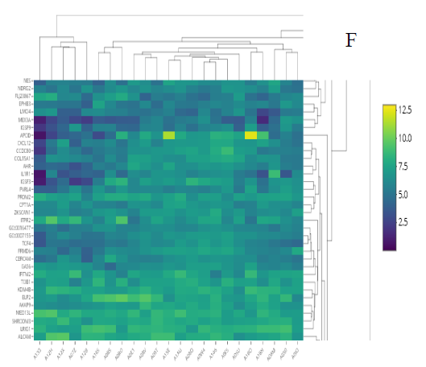
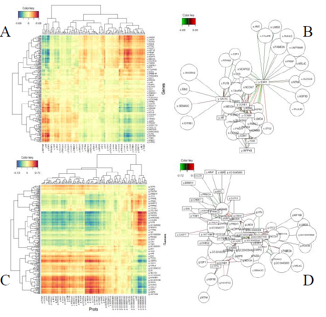
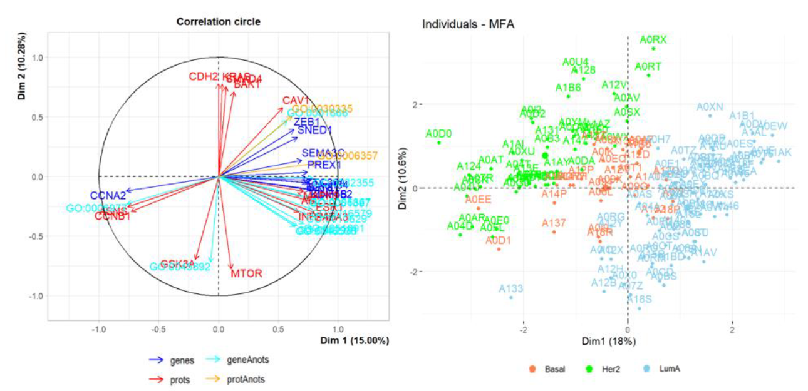

---
output:
  #bookdown::html_document2: default
  #bookdown::word_document2: default
  bookdown::pdf_document2:
    template: templates/template.tex
documentclass: book
#bibliography: [bibliography/references.bib, bibliography/additional-references.bib]
---

# Results {#results}
\chaptermark{Results}
\minitoc <!-- this will include a mini table of contents-->

Text de presentacio dels resultats...

## Results from the analysis of human brain tissue samples

## Results from the expansion of omics data with biological annotations

Figure \@ref(fig:fig4-1) is an snapshot (F) of one of the heat maps created to show the expanded matrices obtained in (Figures \@ref(fig:fig3-4) i \@ref(fig:fig3-5) prèvies, de Methods).

```{r fig4-1, fig.align='center', fig.cap="Heapmap of an expanded matrix", out.width="95%", echo=FALSE}

```


## Results from the analysis of 150 TCGA-BRCA samples

Figure \@ref(fig:fig4-2) contains some of the graphical results of the analysis of the 150 samples from TCGA-BRCA: Heat maps (A, C) and association networks (B, D) resulting from the integration by Regularized Canonical Correlations Analysis with mixomics R package. Performed with the original data sets (A, B) or using data expanded with biological annotations to Gene Ontology (C, D), so adding some GO terms to the features from each source, where the outputs contain higher level of information (higher density in both type of plots).

```{r fig4-2, fig.align='center', fig.cap="BRCA results overview", out.width="95%", echo=FALSE}

```

## Results from the application of MFA on TCGA-BRCA data with, and without, expanded data

Figure \@ref(fig:fig4-3) includes a Correlation Circle (left), with most relevant genes, proteins and added GO annotations. Distribution of samples (right) along the first two plotted dimensions. Both results coming from the application of Multiple Factor Analysis (FactoMineR and factoextra R packages) performed on the same 150 samples (Basal, Her2 and LuminalA conditions) from TCGA-BRCA.

```{r fig4-3, fig.align='center', fig.cap="BRCA results with MFA", out.width="95%", echo=FALSE}

```

\clearpage

## Citations
The usual way to include citations in an *R Markdown* document is to put references in a plain text file with the extension **.bib**, in **BibTex** format.[^bib-formats]
Then reference the path to this file in **index.Rmd**'s YAML header with `bibliography: example.bib`.

[^bib-formats]: The bibliography can be in other formats as well, including EndNote (**.enl**) and RIS (**.ris**), see [rmarkdown.rstudio.com/authoring_bibliographies_and_citations](https://rmarkdown.rstudio.com/authoring_bibliographies_and_citations.html).

Most reference managers can create a .bib file with you references automatically.
However, the **by far** best reference manager to use with *R Markdown* is [Zotero](https://www.zotero.org) with the [Better BibTex plug-in](https://retorque.re/zotero-better-bibtex/), because the `citr` plugin for RStudio (see below) can read references directly from your Zotero library!

Here is an example of an entry in a **.bib** file:
```bibtex
@article{Shea2014,
  author =        {Shea, Nicholas and Boldt, Annika},
  journal =       {Trends in Cognitive Sciences},
  pages =         {186--193},
  title =         {{Supra-personal cognitive control}},
  volume =        {18},
  year =          {2014},
  doi =           {10.1016/j.tics.2014.01.006},
}
```

In this entry highlighed section, 'Shea2014' is the **citation identifier**.
To default way to cite an entry in your text is with this syntax: `[@citation-identifier]`.

So I might cite some things [@Shea2014; @Lottridge2012; @Mill1965].

### Appearance of citations and references section (pandoc) {#citation-appearance}
By default, `oxforddown` lets [Pandoc](https://pandoc.org) handle how citations are inserted in your text and the references section.
You can change the appearance of citations and references by specifying a CSL (Citation Style Language) file in the `csl` metadata field of **index.Rmd**.
By default, `oxforddown` by the Americal Psychological Association (7th Edition), which is an author-year format.

With this style, a number of variations on the citation syntax are useful to know:

- Put author names outside the parenthesis
  - This: `@Shea2014 says blah.`
  - Becomes: @Shea2014 says blah.
- Include only the citation-year (in parenthesis)
  - This: `Shea et al. says blah [-@Shea2014]`
  - Becomes: Shea et al. says blah [-@Shea2014]
- Add text and page or chapter references to the citation
  - This: `[see @Shea2014, pp. 33-35; also @Wu2016, ch. 1]`
  - Becomes: Blah blah [see @Shea2014, pp. 33-35; also @Wu2016, ch. 1].


If you want a numerical citation style instead, try `csl: bibliography/transactions-on-computer-human-interaction.csl` or just have a browse through the [Zotero Style Repository](https://www.zotero.org/styles) and look for one you like.
For convenience, you can set the line spacing and the space between the bibliographic entries in the reference section directly from the YAML header in **index.Rmd**.

If you prefer to use `biblatex` or `natbib` to handle references, see [this chapter](#customising-citations).

\clearpage

<!-- clearpage ends the page, and also dumps out all floats.
  Floats are things like tables and figures. -->

### Insert references easily with RStudio's Visual Editor 
For an easy way to insert citations, use RStudio's [Visual Editor](https://rstudio.github.io/visual-markdown-editing/citations.html).
Make sure you have the latest version of RStudio -- the visual editor was originally really buggy, especially in relation to references, but as per v2022.02.0, it's great!


## Cross-referencing
We can make cross-references to **sections** within our document, as well as to **figures** (images and plots) and **tables**.

The general cross-referencing syntax is **`\@ref(label)`**

### Section references
Headers are automatically assigned a reference label, which is the text in lower caps separated by dashes. For example, `# My header` is automatically given the label `my-header`. So `# My header` can be referenced with `\@ref(my-section)`

Remember what we wrote in section \@ref(citations)?

We can also use **hyperlink syntax** and add \# before the label, though this is only guaranteed to work properly in HTML output:

- So if we write `Remember what we wrote up in [the previous section](#citations)?`
- It becomes Remember what we wrote up in [the previous section](#citations)?

#### Creating custom labels
It is a very good idea to create **custom labels** for our sections. This is because the automatically assigned labels will change when we change the titles of the sections - to avoid this, we can create the labels ourselves and leave them untouched if we change the section titles.

We create custom labels by adding `{#label}` after a header, e.g. `# My section {#my-label}`.
See [our chapter title](#cites-and-refs) for an example. That was section \@ref(cites-and-refs).

### Figure (image and plot) references
- To refer to figures (i.e. images and plots) use the syntax `\@ref(fig:label)`
- **GOTCHA**: Figures and tables must have captions if you wish to cross-reference them.

Let's add an image:
```{r captain, fig.align='center', fig.cap="A marvel-lous meme", out.width="65%"}
knitr::include_graphics("figures/sample-content/captain.jpeg")
```

We refer to this image with `\@ref(fig:captain)`.
So Figure \@ref(fig:captain) is [this image](#fig:captain).

And in Figure \@ref(fig:cars-plot) we saw a [cars plot](#fig:cars-plot).


### Table references
- To refer to tables use the syntax `\@ref(tab:label)`

Let's include a table:
```{r cars-table2}
knitr::kable(cars[1:5,],
            caption="Stopping cars")
```

We refer to this table with `\@ref(tab:cars-table2)`. 
So Table \@ref(tab:cars-table2) is [this table](#tab:cars-table2).

And in Table \@ref(tab:cars-table) we saw more or less [the same cars table](#tab:cars-table).

### Including page numbers
Finally, in the PDF output we might also want to include the page number of a reference, so that it's easy to find in physical printed output.
LaTeX has a command for this, which looks like this: `\pageref{fig/tab:label}` (note: curly braces, not parentheses)

When we output to PDF, we can use raw LaTeX directly in our .Rmd files. So if we wanted to include the page of the cars plot we could write:

- This: `Figure \@ref(fig:cars-plot) on page \pageref(fig:cars-plot)`
- Becomes: Figure \@ref(fig:cars-plot) on page \pageref{fig:cars-plot}

#### Include page numbers only in PDF output
A problem here is that LaTeX commands don't display in HTML output, so in the gitbook output we'd see simply "Figure \@ref(fig:cars-plot) on page ".

One way to get around this is to use inline R code to insert the text, and use an `ifelse` statement to check the output format and then insert the appropriate text.

- So this: `` ``r ''`r ifelse(knitr::is_latex_output(), "Figure \\@ref(fig:cars-plot) on page \\pageref{fig:cars-plot}", "")` ``
- Inserts this (check this on both PDF and gitbook): `r ifelse(knitr::is_latex_output(), "Figure \\@ref(fig:cars-plot) on page \\pageref{fig:cars-plot}", "")`

Note that we need to escape the backslash with another backslash here to get the correct output.


## Collaborative writing

Best practices for collaboration and change tracking when using R Markdown are still an open question. 
In the blog post [**One year to dissertate**](https://livefreeordichotomize.com/2018/09/14/one-year-to-dissertate/) by Lucy D'Agostino, which I highly recommend, the author notes that she knits .Rmd files to a word document, then uses the `googledrive` R package to send this to Google Drive for comments / revisions from co-authors, then incorporates Google Drive suggestions *by hand* into the .Rmd source files. 
This is a bit clunky, and there are ongoing discussions among the _R Markdown_ developers about what the best way is to handle collaborative writing (see [issue #1463](https://github.com/rstudio/rmarkdown/issues/1463) on GitHub, where [CriticMarkup](http://criticmarkup.com) is among the suggestions).

For now, this is an open question in the community of R Markdown users. 
I often knit to a format that can easily be imported to Google Docs for comments, then go over suggested revisions and manually incorporate them back in to the .Rmd source files. 
For articles, I sometimes upload a near-final draft to [Overleaf](https://www.overleaf.com/), then collaboratively make final edits to the LaTeX file there. 
I suspect some great solution will be developed in the not-to-distant future, probably by the RStudio team.


## Additional resources

- *R Markdown: The Definitive Guide* - <https://bookdown.org/yihui/rmarkdown/>

- *R for Data Science* - <https://r4ds.had.co.nz>

<!-- LaTeX normally does not indent the first line after a heading - however, it does so after the mini table of contents. You can manually tell it not to with \noindent -->

\noindent This chapter describes a number of additional tips and tricks as well as possible customizations to the `oxforddown` thesis.

## Chunk caching and the **\_bookdown\_files** folder
If you set `cache=TRUE` in a code chunk, in order to cache its results if it's time-consuming to run see [the R Markdown documentation](https://bookdown.org/yihui/rmarkdown-cookbook/cache.html), then the files for the caching are stored in the **_bookdown_files** folder.

If you don't use caching and you would like to just have the **_bookdown_files** folder deleted after the build process is complete, then set `allow_cache = FALSE` in **index.Rmd**'s call to `knit_thesis`.

That is, your YAML should then look like this:

```yaml
knit: (function(input, ...) {
    thesis_formats <- "pdf";
    
    source("scripts_and_filters/knit-functions.R");
    knit_thesis(input, thesis_formats, allow_cache = FALSE, ...)
  })
```

## Front matter
### Shorten captions shown in the list of figures (PDF)
You might want your list of figures (which follows the table of contents) to have shorter (or just different) figure descriptions than the actual figure captions.

Do this using the chunk option `fig.scap` ('short caption'), for example `{r captain-image, fig.cap="A very long and descriptive (and potentially boring) caption that doesn't fit in the list of figures, but helps the reader understand what the figure communicates.", fig.scap="A concise description for the list of figures"`


### Shorten captions shown in the list of tables (PDF)
You might want your list of tables (which follows the list of figures in your thesis front matter) to have shorter (or just different) table descriptions than the actual table captions.

If you are using `knitr::kable` to generate a table, you can do this with the argument `caption.short`, e.g.:

```r
knitr::kable(mtcars,
              caption = "A very long and descriptive (and potentially
              boring) caption that doesn't fit in the list of figures,
              but helps the reader understand what the figure 
              communicates.",
              caption.short = "A concise description for the list of tables")
```

## Shorten running header (PDF)
You might want a chapter's running header (i.e. the header showing the title of the current chapter at the top of page) to be shorter (or just different) to the actual chapter title.

Do this by adding the latex command `\chaptermark{My shorter version}` after your chapter title.

For example, chapter \@ref(cites-and-refs)'s running header is simply 'Cites and cross-refs', because it begins like this:

```markdown
# Citations, cross-references, and collaboration {#cites-and-refs} 
\chaptermark{Cites and cross-refs}
```

## Unnumbered chapters
To make chapters unnumbered (normally only relevant to the Introduction and/or the Conclusion), follow the chapter header with `{-}`, e.g. `# Introduction {-}`.

When you do this, you must also follow the heading with these two latex commands:
```latex
\adjustmtc
\markboth{The Name of Your Unnumbered Chapter}{}
```

Otherwise the chapter's mini table of contents and the running header will show the previous chapter.


## Beginning chapters with quotes (PDF)
The OxThesis LaTeX template lets you inject some wittiness into your thesis by including a block of type `savequote` at the beginning of chapters. 
To do this, use the syntax ```` ```{block type='savequote'} ````.^[For more on custom block types, see the relevant section in [_Authoring Books with R Markdown_](https://bookdown.org/yihui/bookdown/custom-blocks.html).]

Add the reference for the quote with the chunk option `quote_author="my author name"`. 
You will also want to add the chunk option `include=knitr::is_latex_output()` so that quotes are only included in PDF output.

It's not possible to use markdown syntax inside chunk options, so if you want to e.g. italicise a book name in the reference use a ['text reference'](https://bookdown.org/yihui/bookdown/markdown-extensions-by-bookdown.html#text-references): Create a named piece of text with '(ref:label-name) My text', then point to this in the chunk option with `quote_author='(ref:label-name)'`.


## Highlighting corrections (HTML & PDF)
For when it comes time to do corrections, you may want to highlight changes made when you submit a post-viva, corrected copy to your examiners so they can quickly verify you've completed the task. 
You can do so like this:

### Short, inline corrections
Highlight **short, inline corrections** by doing `[like this]{.correction}` --- the text between the square brackets will then [be highlighted in blue]{.correction} in the output.

Note that pandoc might get confused by citations and cross-references inside inline corrections.
In particular, it might get confused by `"[what @Shea2014 said]{.correction}"` which becomes [what @Shea2014 said]{.correction}
In such cases, you can use LaTeX syntax directly. 
The correction highlighting uses the [soul](https://ctan.org/pkg/soul) package, so you can do like this:

- If using biblatex for references, use `"\hl{what \textcite{Shea2014} said}`
- If using natbib for references, use `"\hl{what \cite{Shea2014} said}`

Using raw LaTeX has the drawback of corrections then not showing up in HTML output at all, but you might only care about correction highlighting in the PDF for your examiners anyway!


### Blocks of added or changed material
Highlight entire **blocks of added or changed material** by putting them in a block of type `correction`, using the syntax ```` ```{block type='correction'} ````.^[In the **.tex** file for PDF output, this will put the content between `\begin{correction}` and `\end{correction}`; in gitbook output it will be put between `<div class="correction">` and `</div>`.]
Like so:

```{block type='correction', include=knitr::is_latex_output() | knitr::is_html_output()}
For larger chunks, like this paragraph or indeed entire figures, you can use the `correction` block type. This environment **highlights paragraph-sized and larger blocks** with the same blue colour.
```

*Note that correction blocks cannot be included in word output.*

### Stopping corrections from being highlighted
To turn off correction highlighting, go to the YAML header of **index.Rmd**, then:

- PDF output: set `corrections: false` \
- HTML output: remove or comment out `- templates/corrections.css`


## Apply custom font color and highlighting to text (HTML & PDF)
The lua filter that adds the functionality to highlight corrections adds two more tricks:
you can apply your own choice of colour to highlight text, or change the font color.
The syntax is as follows:

> Here's `[some text in pink highlighting]{highlight="pink"}` \
> Becomes: Here's [some text in pink highlighting]{highlight="pink"}.

> `[Here's some text with blue font]{color="blue"}` \
> Becomes: [Here's some text with blue font]{color="blue"}

> Finally --- never, ever actually do this -- `[here's some text with black highlighting and yellow font]{highlight="black" color="yellow"}` \
> Becomes: [here's some text with black highlighting and yellow font]{highlight="black" color="yellow"}

The file **scripts_and_filters/colour_and_highlight.lua** implements this, if you want to fiddle around with it.
It works with both PDF and HTML output.

## Adding a second abstract (PDF)
You may need two abstracts in your thesis, if you e.g. need both an abstract in English and some other language.

You can add a second abstract in **index.Rmd** like so:

``` yaml
abstract-second-heading: "Resumé"
abstract-second: "This is the second abstract, for example in beautiful French." 
```

## Including another paper in your thesis - embed a PDF document {#embed-pdf}

You may want to embed existing PDF documents into the thesis, for example if your department allows a 'portfolio' style thesis and you need to include an existing typeset publication as a chapter. 

In gitbook output, you can simply use `knitr::include_graphics` and it should include a scrollable (and downloadable) PDF.
You will probably want to set the chunk options `out.width='100%'` and `out.height='1000px'`:

```{r, eval=knitr::is_html_output(), out.width='100%', out.height='1000px'}
knitr::include_graphics("figures/sample-content/pdf_embed_example/Lyngs2020_FB.pdf")
```
<br>

In LaTeX output, however, this approach can cause odd behaviour.
Therefore, when you build your thesis to PDF, split the PDF into an alphanumerically sorted sequence of **single-page** PDF files (you can do this automatically with the package `pdftools`). You can then use the appropriate LaTeX command to insert them, as shown below (for brevity, in the `oxforddown` PDF sample content we're only including two pages).
*Note that the chunk option `results='asis'` must be set.*
You may also want to remove margins from the PDF files, which you can do with Adobe Acrobat (paid version) and likely other software.

```{r, echo=TRUE, results='asis', eval=knitr::is_latex_output(), linewidth = 70}
# install.packages(pdftools)
# split PDF into pages stored in figures/sample-content/pdf_embed_example/split/
# pdftools::pdf_split("figures/sample-content/pdf_embed_example/Lyngs2020_FB.pdf",
#        output = "figures/sample-content/pdf_embed_example/split/")

# grab the pages
pages <- list.files("figures/sample-content/pdf_embed_example/split", full.names = TRUE)

# set how wide you want the inserted PDFs to be: 
# 1.0 is 100 per cent of the oxforddown PDF page width;
# you may want to make it a bit bigger
pdf_width <- 1.2

# for each PDF page, insert it nicely and
# end with a page break
cat(stringr::str_c("\\newpage \\begin{center} \\makebox[\\linewidth][c]{\\includegraphics[width=", pdf_width, "\\linewidth]{", pages, "}} \\end{center}"))

```
